# Session 19: Cloud and Terraform in Action

This README captions the screenshots from the Session 19 Terraform mini-project. The screenshots document a successful Terraform plan and apply for foundational AWS networking resources in `ap-south-1`, followed by Terraform outputs and state inspection.

> **Scope of the captured project:** The plan and state screenshots show six resources: a VPC, public subnet, Internet Gateway, public route table, route-table association, and web Security Group. They do **not** show an EC2 instance or S3 bucket, although those appear in the suggested architecture. The screenshots also do not show a `terraform destroy` run. No claim is made here that those resources were created or destroyed.

## Architecture shown

```text
AWS Region: ap-south-1
└── VPC: 10.20.0.0/16
    ├── Public subnet: 10.20.1.0/24 (ap-south-1a)
    ├── Internet Gateway
    ├── Public route table
    │   └── 0.0.0.0/0 -> Internet Gateway
    ├── Association: public subnet -> public route table
    └── Web Security Group
        ├── HTTP inbound: TCP/80 from 0.0.0.0/0
        ├── HTTPS inbound: TCP/443 from 0.0.0.0/0
        └── Outbound: all IPv4 traffic
```

The VPC and subnet settings make this a public-network foundation. The plan shows public IPv4 address mapping enabled for the subnet, and the route table has a default route to the Internet Gateway.

**Security consideration:** The demonstrated web Security Group allows HTTP and HTTPS from any IPv4 address and allows all outbound IPv4 traffic. This may be appropriate for a public web entry point, but it is not sufficient on its own to make a workload secure. Restrict inbound administration, avoid exposing data services directly, and narrow outbound access where practical. No EC2 instance appears in the captured plan.

## Terraform concepts demonstrated

- **Provider:** The initialized configuration downloads the HashiCorp AWS provider (`6.68.0` shown in the initialization screenshot).
- **Variables:** The command copies `terraform.tfvars.example` to `terraform.tfvars` before initialization. Keep account-specific or sensitive variable values out of source control.
- **Resources:** The plan lists six AWS networking resources to create.
- **Dependencies:** Terraform derives ordering from resource references. For example, the subnet and Internet Gateway depend on the VPC, the route references the Internet Gateway, and the route-table association references both the subnet and route table.
- **Outputs:** The apply output reports `security_group_id`, `subnet_id`, `vpc_cidr`, and `vpc_id`.
- **State:** `terraform state list` shows the six managed resource addresses. Terraform state maps configuration resources to real AWS resources and can contain sensitive information; protect it and do not commit it publicly.
- **Plan/apply:** `terraform plan` previews changes; `terraform apply` requests approval and creates the resources.
- **Destroy:** `terraform destroy` removes resources managed by the configuration after confirmation. No destroy result is visible in these screenshots.

## Captured command workflow

Run Terraform commands from the project directory that contains the configuration files. These commands are transcribed from the screenshots; this README folder contains the screenshots and documentation, not the Terraform source files shown in them.

### 1. Prepare variables and initialize

```sh
cp terraform.tfvars.example terraform.tfvars
terraform init
```

The example variable file is copied to the working `terraform.tfvars`, and `terraform init` downloads the AWS provider. Review `terraform.tfvars` and keep credentials out of it; authenticate with an approved AWS credential provider such as AWS IAM Identity Center or a role.

### 2. Format and validate

```sh
terraform fmt
terraform validate
```

The screenshot shows `main.tf` formatted and `terraform validate` returning `Success! The configuration is valid.` Validation checks configuration structure, not AWS credentials, permissions, quotas, or whether the proposed infrastructure is secure.

### 3. Review the plan

```sh
terraform plan
```

The captured plan reports **6 to add, 0 to change, 0 to destroy**. Before applying, review the active AWS account and region, CIDR ranges, subnet public-address setting, route targets, Security Group rules, and cost implications. The plan shows HTTP and HTTPS exposed to `0.0.0.0/0`.

For production automation, a saved plan can make the reviewed actions explicit:

```sh
terraform plan -out=tfplan
terraform show tfplan
terraform apply tfplan
```

Treat `tfplan` as sensitive and do not publish it.

### 4. Apply the infrastructure

```sh
terraform apply
```

Terraform prompts for confirmation. Type `yes` only after reviewing the plan. The captured apply reports **6 added, 0 changed, 0 destroyed** and prints the four outputs.

### 5. Inspect outputs and state

```sh
terraform output
terraform state list
```

The captured output shows the VPC CIDR, VPC ID, subnet ID, and Security Group ID. The state list contains:

```text
aws_internet_gateway.main
aws_route_table.public
aws_route_table_association.public
aws_security_group.web
aws_subnet.public
aws_vpc.main
```

Terraform state is operationally important and may expose infrastructure details or sensitive values. Use an access-controlled remote backend with state locking for team or production use; do not share state files in screenshots or commit them to source control.

### 6. Destroy when finished

The following commands describe the cleanup step; the supplied screenshots do not show them being executed:

```sh
terraform plan -destroy
terraform destroy
```

Inspect the destruction plan, confirm the AWS account and workspace, and approve only when the resources are safe to remove. Destruction can interrupt workloads and delete data. Keep any resources you still need and clean up only the resources managed by this project.

## Screenshots

### Plan and configuration

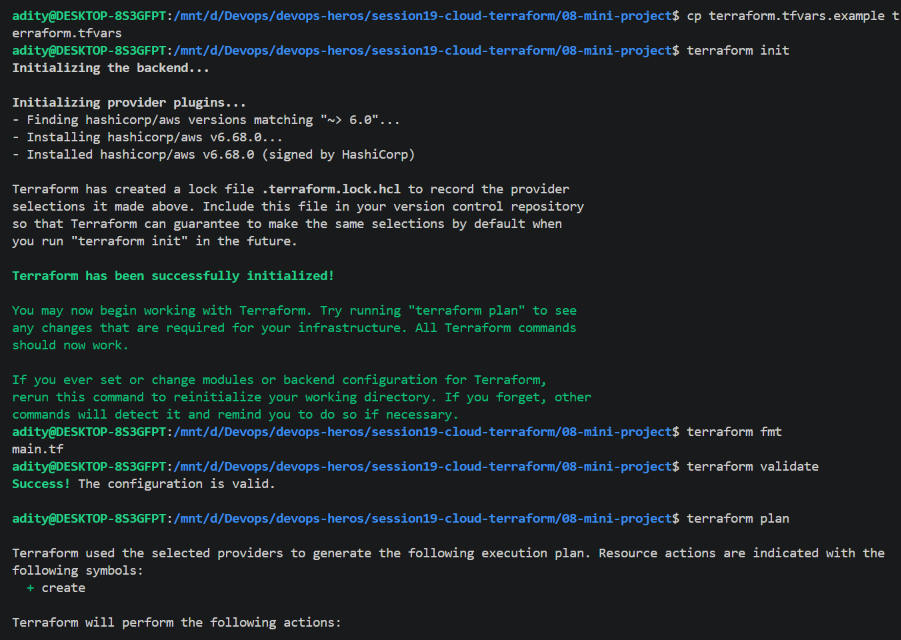

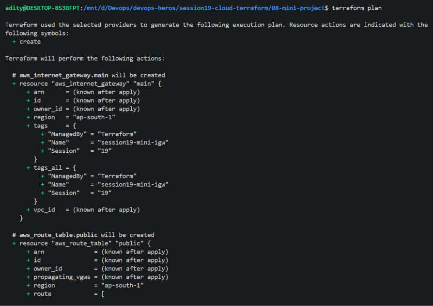

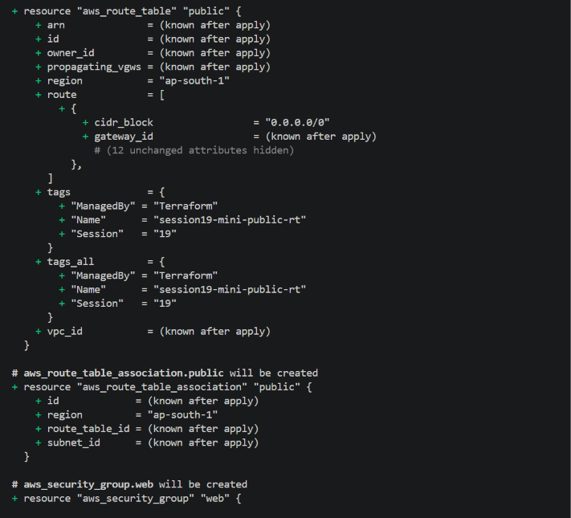

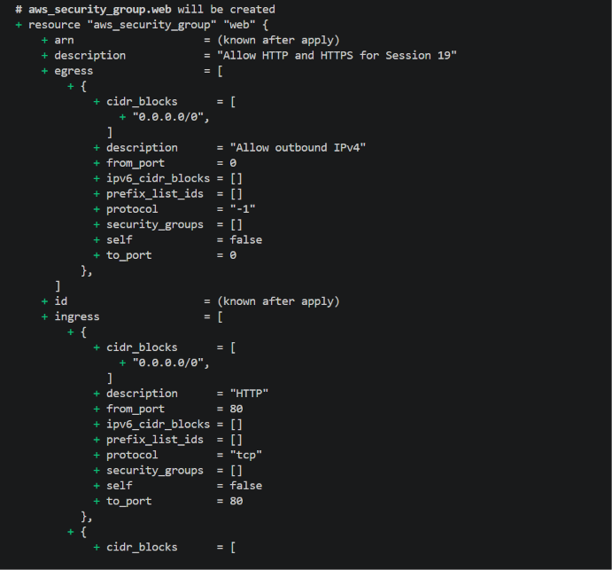

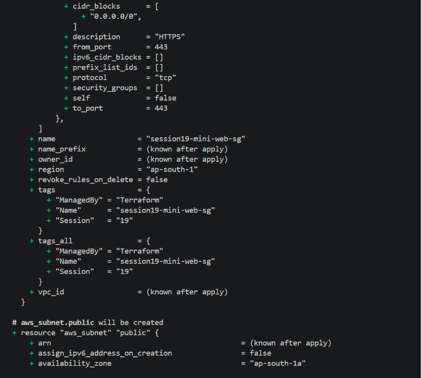

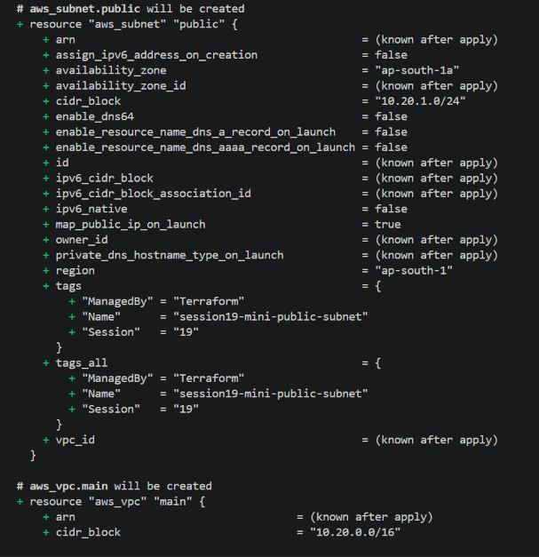

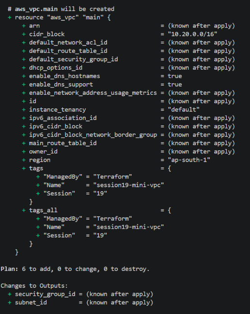

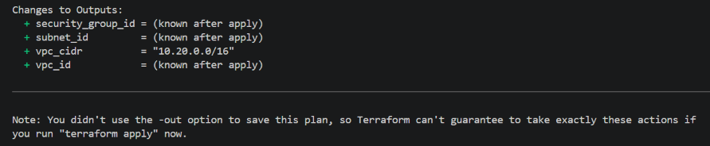

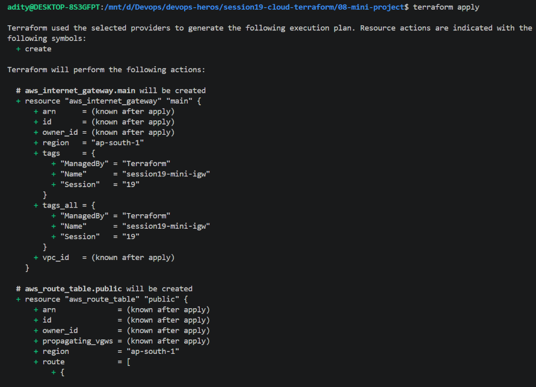

### Apply, outputs, and state

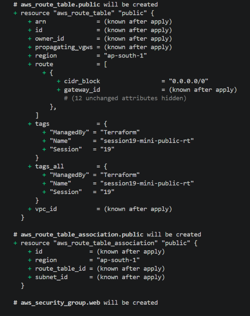

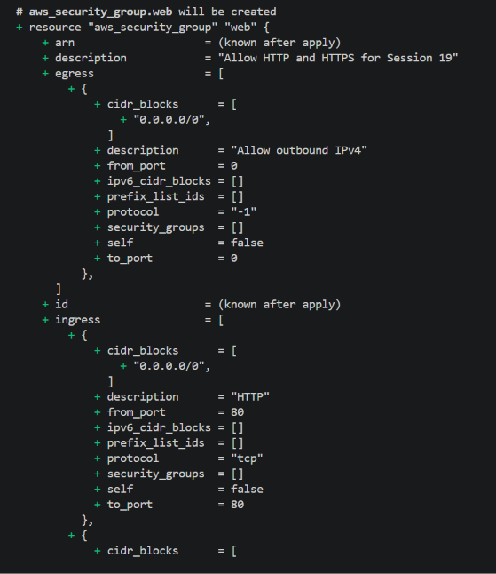

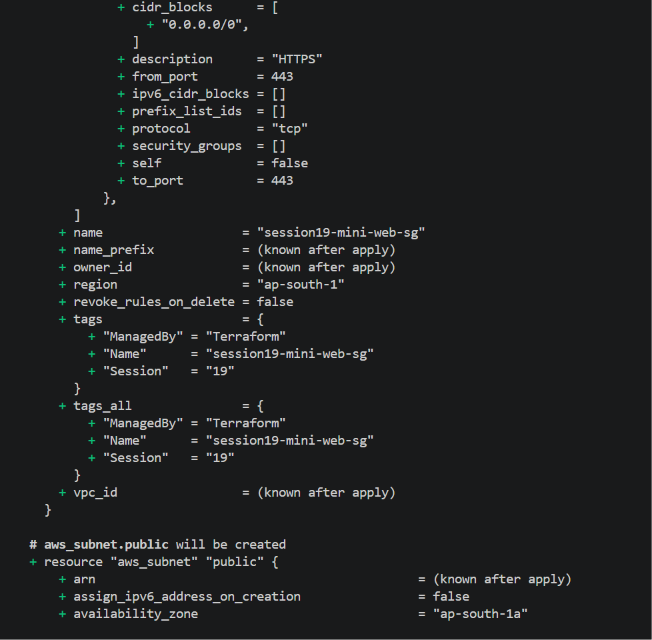

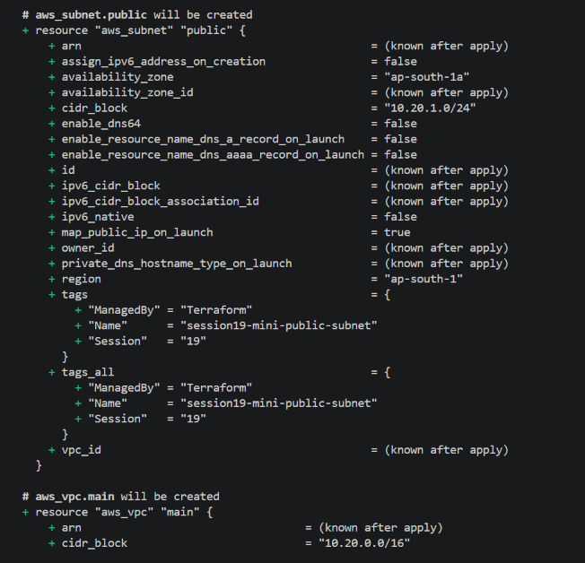

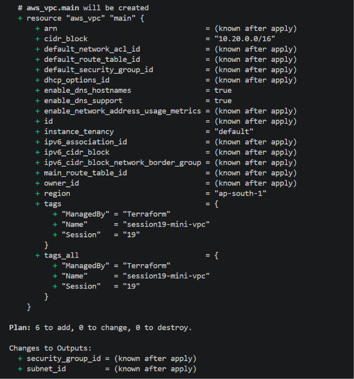

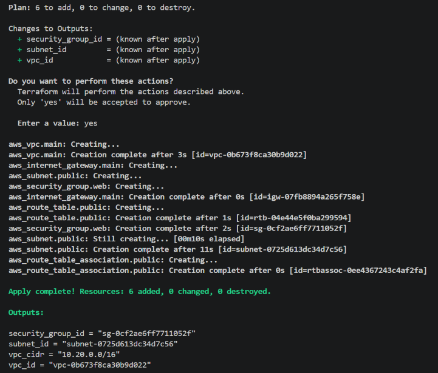

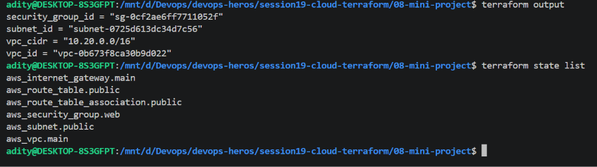
