# Session 17: CI/CD and DevSecOps

This folder contains screenshots from a Flask-based DevSecOps dashboard demonstration. The screenshots document local execution, tests, Docker, a GitHub Actions run, and Kubernetes commands. They are evidence from the demonstrated project; this folder itself contains screenshots and this README, not the application source, Dockerfile, workflow, or Kubernetes manifests.

## What the demonstration covers

The documented pipeline follows this flow:

```text
Source
  -> Unit tests
  -> SAST (CodeQL)
  -> SCA / dependency scan
  -> Docker build
  -> Container image scan (Trivy)
  -> Push image to Docker Hub
  -> Deploy to Kubernetes
```

The GitHub Actions screenshot shows a successful run with the Unit Tests, SAST - CodeQL, SCA - Dependency Scan, Docker Build, Image Scan - Trivy, Push Image to Docker Hub, and Deploy to Kubernetes jobs marked successful. The test and security checks appear before image publication and Kubernetes deployment.

### Security gate and scope

The green run shows the listed checks passed for that run, allowing the later build, push, and deployment jobs to proceed. The screenshot does not show the workflow's exact vulnerability thresholds or failure policy, so it does not establish which finding severities block a release.

**Secret scanning is not visible in the captured workflow run.** Do not infer that a secret scanner ran from the green status alone. To claim secret scanning coverage, confirm that the workflow or repository security settings enable a scanner and review its result.

The GitHub Actions screenshot is from `mr-panther01/python-app`, run `#2`, on `main` at commit `c64e554`; it completed successfully in 5m 13s. It is a captured reference execution, not a run initiated from this README or a guarantee that the current GitHub configuration remains unchanged.

## Local application and tests

The local screenshots show a Python virtual environment being created, Flask dependencies installed from `requirements.txt`, and the dashboard started with:

```sh
python3 app/app.py
```

The app is shown listening locally on port `5001`. The browser screenshots show the DevSecOps Hub dashboard and successful JSON responses from `/health` and `/api/greet/Nensi`.

The test screenshot shows the project running `pytest` with coverage enabled:

```sh
python3 -m pip install -r requirements-dev.txt
python3 -m pytest --cov=app --cov-report=term-missing
```

Captured result: **8 tests passed**, with a reported **69% total coverage**. Pytest also displayed six `datetime.datetime.utcnow()` deprecation warnings. These warnings did not fail the captured run, but the application should use timezone-aware UTC datetimes in a future cleanup.

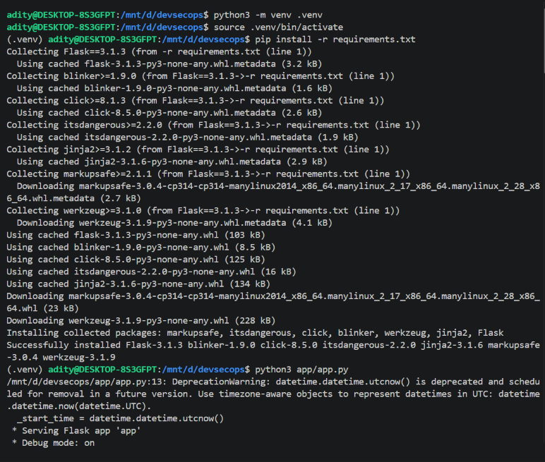

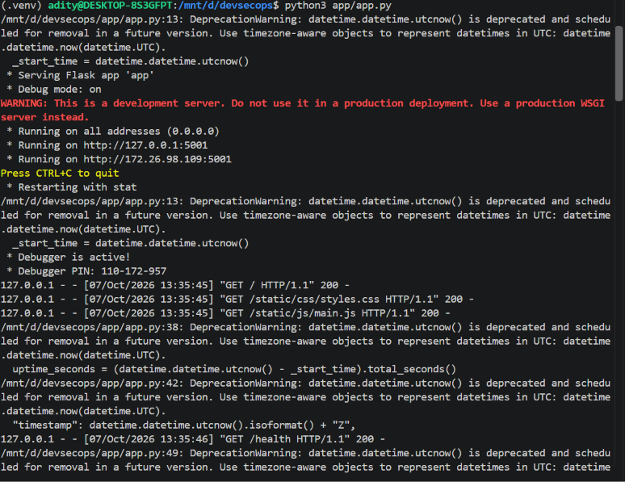

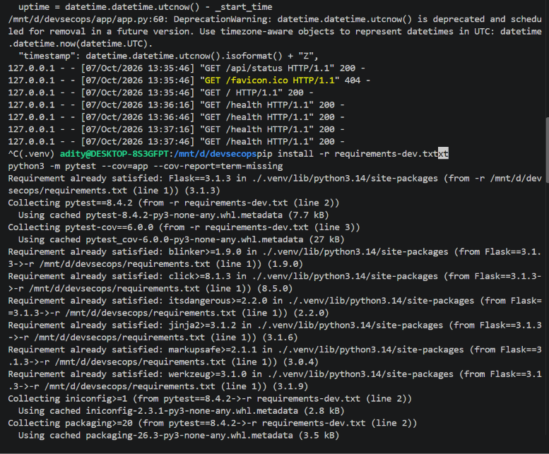

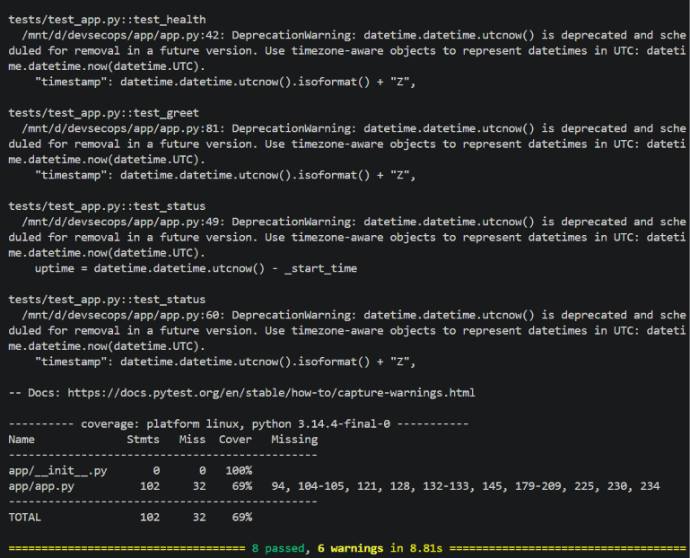

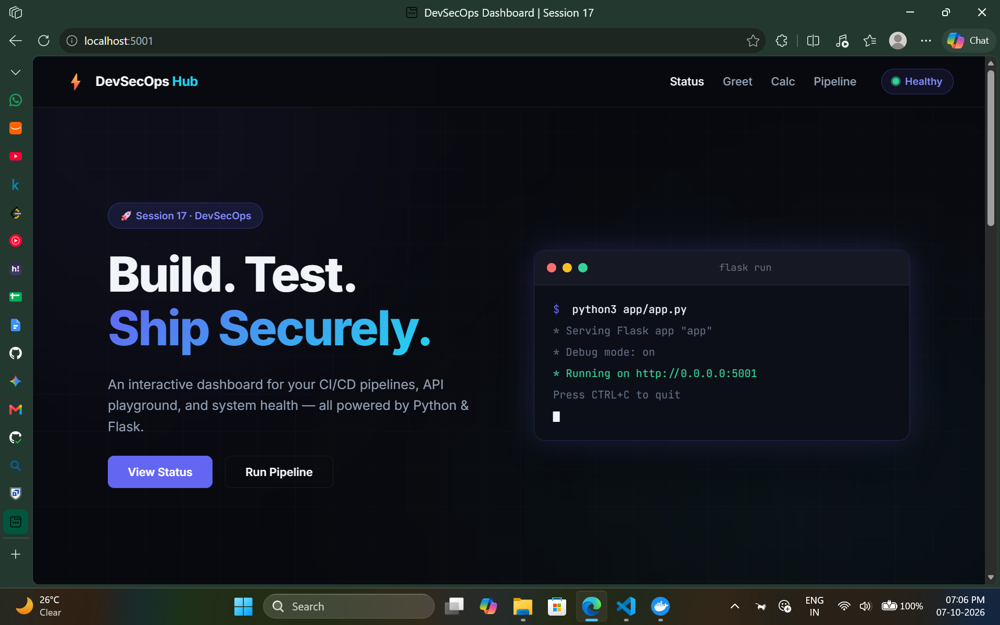

## Docker demonstration

The Docker screenshots show the image being built and the dashboard run with port `5001` mapped to the host:

```powershell
docker build -t hey-cicd:latest .
docker run -p 5001:5001 hey-cicd:latest
```

The container log shows Flask serving the application and returning HTTP 200 responses for dashboard assets, `/health`, and `/api/status`. The image was tagged `hey-cicd:latest` in the local Docker commands.

One cleanup attempt failed because the image was still referenced by a container; after stopping the container, removing the image succeeded. This illustrates the order needed for local cleanup:

```powershell
docker ps
docker stop <container-id>
docker rm <container-id>
docker rmi hey-cicd:latest
```

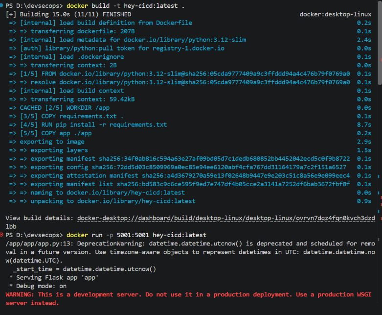

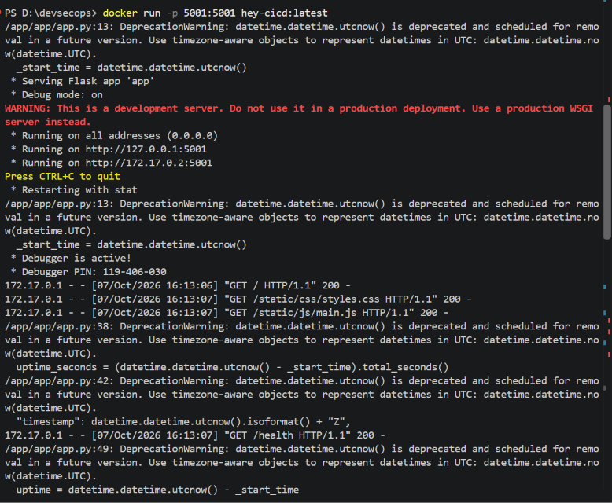

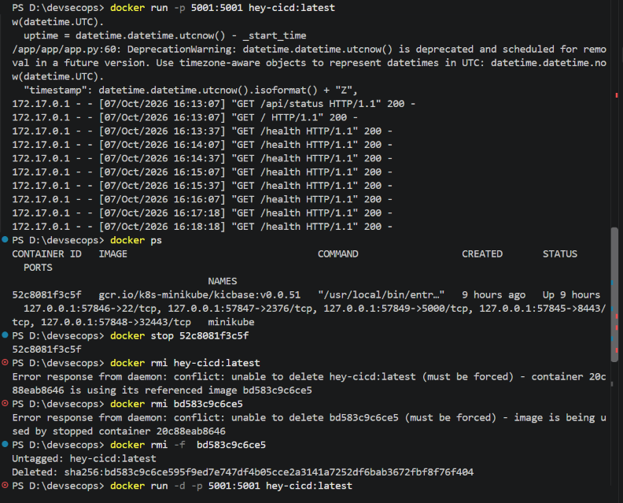

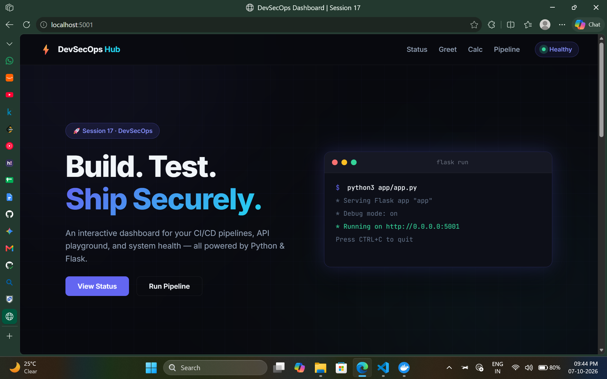

## GitHub Actions pipeline execution

The captured Actions page reports a successful `Python DevSecOps Pipeline` run on `main`. The job graph shows the initial checks followed by container build and delivery:

1. **Unit Tests** — run the application's test suite.
2. **SAST - CodeQL** — analyze source code for static security issues.
3. **SCA - Dependency Scan** — check application dependencies for known vulnerabilities.
4. **Docker Build** — build the application container image.
5. **Image Scan - Trivy** — scan the image for known vulnerabilities.
6. **Push Image to Docker Hub** — publish the image after preceding checks pass.
7. **Deploy to Kubernetes** — deploy the image to the configured cluster.

All these displayed jobs have green checks in the screenshot. The visual layout shows the unit, SAST, and SCA jobs as initial checks, with Docker Build, Image Scan, registry push, and Kubernetes deployment in sequence.

The screenshot is evidence of that specific run. It does not show a secret-scanning job; secret scanning should be separately enabled and verified if it is a required security gate.

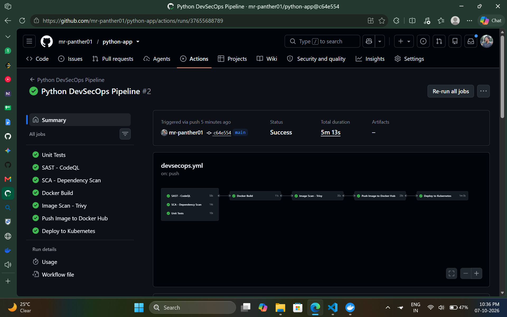

## Kubernetes deployment evidence

The screenshots show the deployment and Service being applied from a `k8s/` directory:

```powershell
kubectl apply -f k8s/deployment.yaml
kubectl apply -f k8s/service.yaml
kubectl get pods
kubectl get service session17-python
minikube service session17-python
```

The apply output reports that the Deployment and Service were created, and the Service is shown as a NodePort on port `30001`. In the separate local Minikube verification, the application Pods are `ImagePullBackOff` / `ErrImagePull`, so the browser URL being printed by `minikube service` is not proof that the application was successfully serving traffic.

The captured evidence does not include the specific image-pull event or a successful post-fix Pod state. To complete that manual verification, inspect the actual failure, fix the configured image reference or registry access, and confirm the Pod is Ready before testing the Service:

```powershell
kubectl describe pod <pod-name>
kubectl get events --sort-by=.metadata.creationTimestamp
kubectl get pods
kubectl get service session17-python
```

The screenshot of the successful GitHub Actions run separately shows the `Deploy to Kubernetes` job as successful for the `python-app` run. Keep that run distinct from the failed local Minikube attempt.

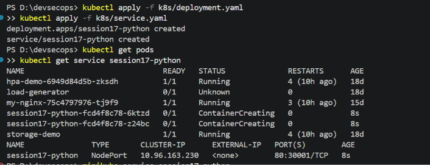

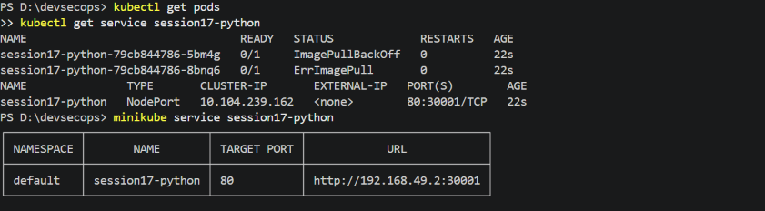

## Evidence summary

| Area | Captured evidence | Notes |
|---|---|---|
| Application | Flask app starts; dashboard and API endpoints respond | Local demo on port 5001 |
| Unit testing | 8 tests passed | 69% total coverage; six datetime deprecation warnings |
| Docker | Image build and container execution | Local tag `hey-cicd:latest` |
| SAST | CodeQL job green in Actions run | Screenshot records one successful execution |
| SCA | Dependency Scan job green in Actions run | Exact tool and severity gate are not shown |
| Secret scanning | Not shown | Enable/configure and verify separately before claiming coverage |
| Image scanning | Trivy job green in Actions run | Exact policy/threshold is not shown |
| Registry | Push Image to Docker Hub job green in Actions run | Successful for the displayed workflow run |
| Kubernetes | Deploy job green in Actions run; separate local Minikube attempt has image-pull errors | These are different execution contexts |

## Screenshots

The earlier sections caption each image alongside the relevant stage. Files are retained with their existing names so the README references do not require adding or renaming screenshot assets.
