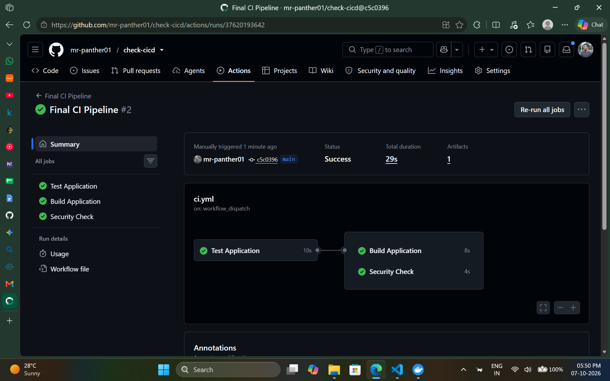
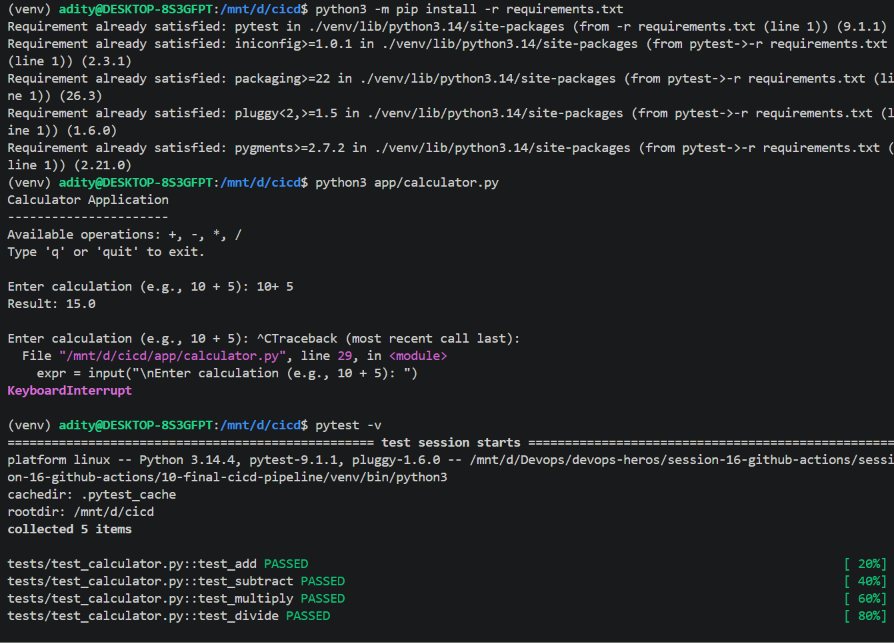
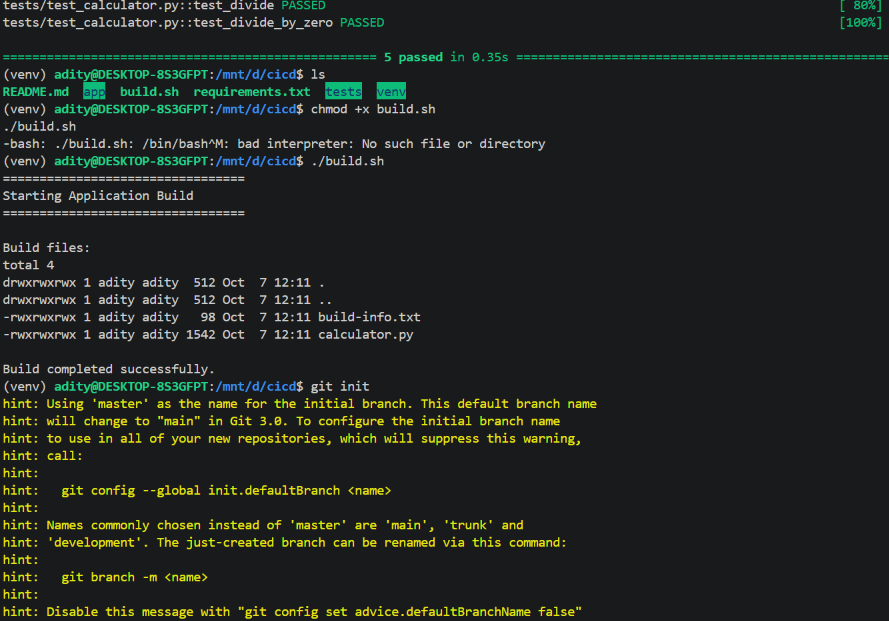
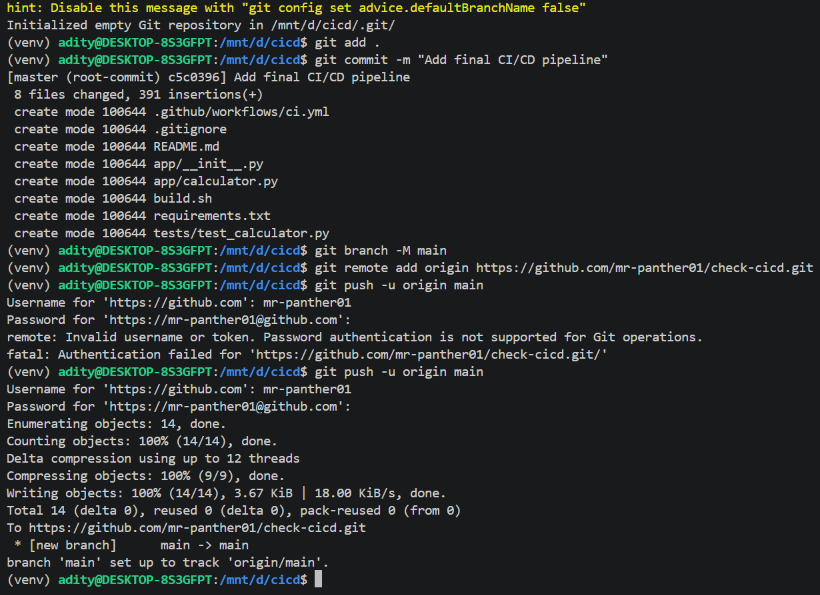

# Session 16: CI/CD with GitHub Actions

This demo packages a small Python command-line calculator as a Docker image. GitHub Actions runs tests and a container smoke test for continuous integration (CI), then publishes the verified image to GitHub Container Registry (GHCR) for continuous delivery (CD).

> The supplied successful-run screenshot is from the referenced `check-cicd` repository. It documents the session's example pipeline, but it is not evidence that the workflows in this project have already run on GitHub. The project workflows are ready to run after these files are pushed to GitHub.

## Project structure

```text
github-actions/
├── app/
│   ├── __init__.py
│   └── calculator.py
├── tests/
│   └── test_calculator.py
├── .dockerignore
├── Dockerfile
└── Readme.md

.github/
└── workflows/
    ├── ci.yml
    └── cd.yml
```

GitHub only discovers Actions workflows from `.github/workflows/` at the repository root, so the two workflow files are stored in the root `.github` directory while the application, tests, and Docker build context live in `github-actions/`.

## CI vs. CD

| Practice | Purpose in this project | Pipeline |
|---|---|---|
| Continuous Integration (CI) | Integrate changes frequently and automatically run tests and a Docker build/smoke test. | `CI` |
| Continuous Delivery (CD) | After tests pass, build and publish a versioned application image to a registry where it is ready to deploy. | `CD` |

The CD workflow delivers a container image to GHCR; it does not deploy to a Kubernetes cluster. No cluster or deployment credentials were supplied for this project. Deploying the published image to a specific environment can be added as a separate protected deployment job.

## GitHub Actions concepts in the workflows

- A **workflow** is an automated pipeline described by a YAML file in `.github/workflows/`. This project has separate CI and CD workflows.
- A **trigger** (`on`) determines when a workflow starts. CI runs on pull requests and pushes to `main` that change this project or its workflow, and can also be started manually. CD runs on pushes to `main`, version tags matching `v*`, or a manual dispatch.
- A **job** is a unit of work that runs on a runner. In CI, `build` depends on `test` through `needs: test`. In CD, `publish` cannot run unless its `test` job passes.
- A **step** is an individual action or shell command inside a job. Steps check out source, set up Python, run tests, build an image, and upload or publish it.
- A **runner** is the machine that executes a job. Both workflows use GitHub-hosted `ubuntu-latest` runners.
- **Secrets** are sensitive values supplied to a workflow without committing them to source. CI needs no secrets. CD uses GitHub's automatically provided `GITHUB_TOKEN` to authenticate to GHCR, with only `packages: write` permission on the publishing job. Do not create a personal access token for this workflow.
- **Artifacts** are files retained from a workflow run. CI uploads the unit-test log and a Docker image archive for up to seven days. The CD workflow publishes the image to GHCR as a package.

No manually configured repository secret is required for this example: GHCR authentication uses the scoped, automatically issued `GITHUB_TOKEN`.

## CI pipeline

Workflow file: [`.github/workflows/ci.yml`](../.github/workflows/ci.yml)

```text
Pull request / push to main / manual run
                  |
                  v
        Test application (Python 3.12)
          |                   |
          |                   +--> Unit-test log artifact
          v
     Build Docker image
          |
          v
  Smoke-test calculator in container
          |
          +--> Docker image archive artifact
```

The build job waits for all tests to pass. The container smoke test executes the program inside the built image and checks that `10 + 5` prints exactly `Result: 15`.

## CD pipeline

Workflow file: [`.github/workflows/cd.yml`](../.github/workflows/cd.yml)

```text
Push to main / version tag (v*) / manual run
                  |
                  v
        Test application (Python 3.12)
                  |
            tests pass
                  v
       Build and publish to GHCR
```

The workflow creates branch, version-tag, commit-SHA, and (on the default branch) `latest` image tags. For a repository named `OWNER/REPO`, the package is published as `ghcr.io/OWNER/REPO`. Check the run's `publish` job and the repository's **Packages** page to verify delivery.

## Run the application locally

Requires Python 3.12 or newer.

```sh
cd github-actions
python -m app.calculator 10 + 5
```

Expected output:

```text
Result: 15
```

Other supported operations are `-`, `*`, and `/`.

## Run tests locally

```sh
cd github-actions
python -m unittest discover -s tests -v
```

The tests use Python's built-in `unittest` module and need no third-party test dependencies. They cover addition, subtraction, multiplication, division, division by zero, an unsupported operation, and result formatting.

## Build and run the Docker image locally

```sh
cd github-actions
docker build -t calculator-demo:local .
docker run --rm calculator-demo:local 10 + 5
```

Expected output:

```text
Result: 15
```

The image uses a slim Python base image, copies only the application package, and runs as a non-root user. The Dockerfile entry point accepts calculator arguments after the image name.

## Trigger the workflows on GitHub

1. Push the repository to GitHub and ensure the default branch is `main`.
2. Open **Actions** and confirm the `CI` and `CD` workflows are listed.
3. Open a pull request targeting `main` to run CI; or push a change under `github-actions/` to `main` to run CI and CD.
4. Wait for the required test job to succeed before the container build or publish job.
5. In a CI run, open **Artifacts** to download `test-results` or `calculator-demo-image`.
6. In a CD run, verify the `Publish image to GHCR` job succeeded and inspect the repository's **Packages** page.

To produce a versioned package, push a tag such as `v1.0.0` after pushing the corresponding source to GitHub.

## Session screenshots

The local screenshot shows the calculator and successful unit tests. The GitHub screenshot shows a successful reference workflow with Test Application, Build Application, and Security Check jobs, plus one uploaded artifact. Other screenshots show the sample project files, build output, and Git push process.








