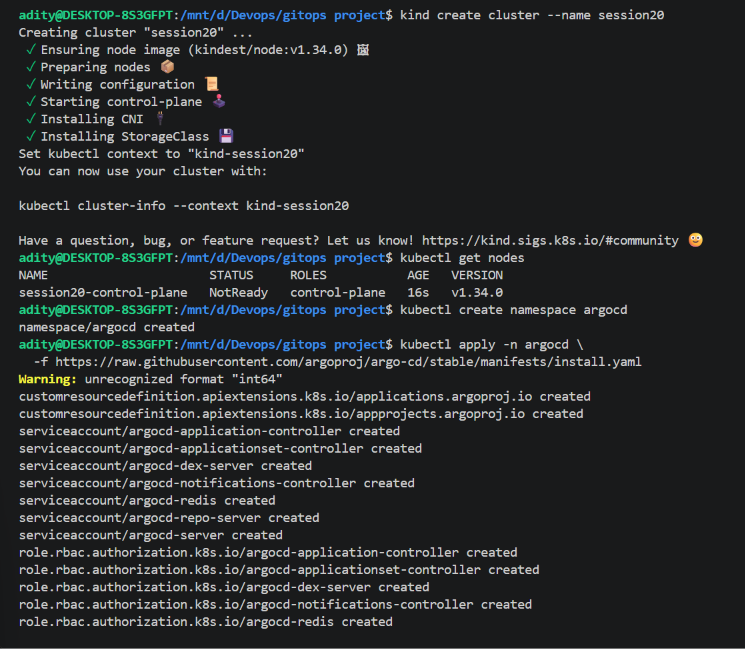
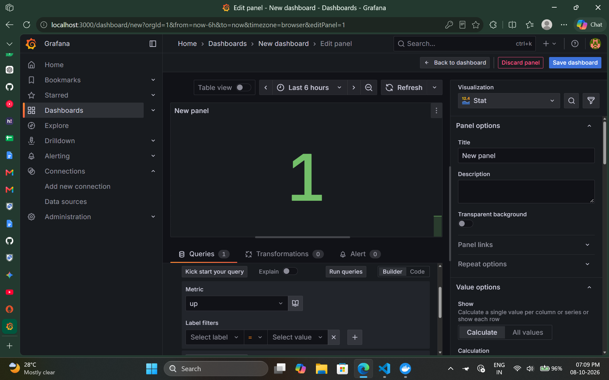
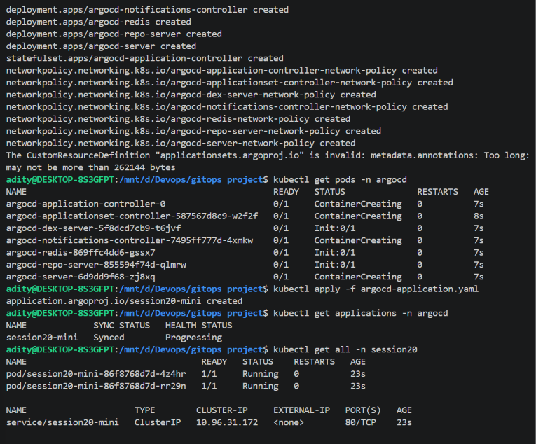
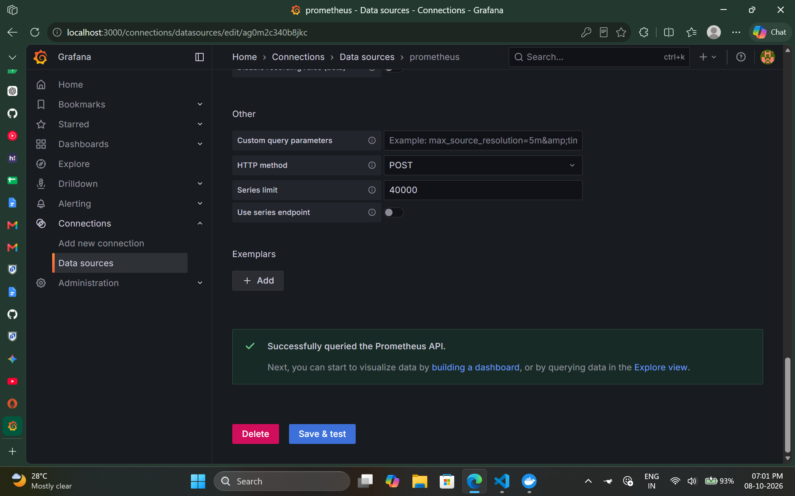
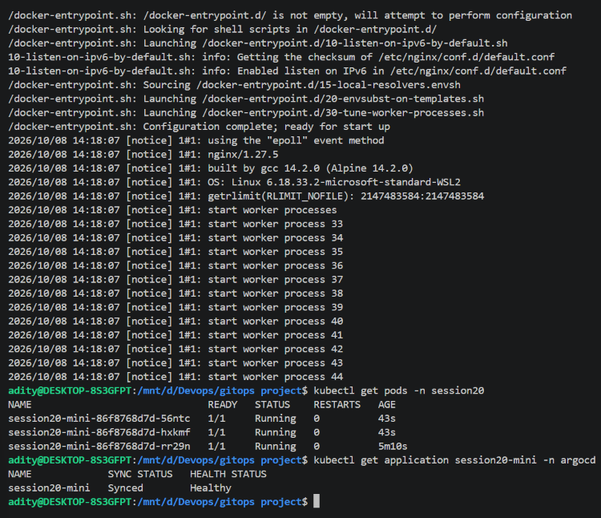

# GitOps Demo

This demo illustrates a Kubernetes GitOps workflow using a local `kind` cluster and Argo CD. The screenshots show the cluster being created, Argo CD being installed, an application being submitted, and the application reaching a synced and healthy state.

## What is GitOps?

GitOps is an operational model where the desired state of an environment is stored as declarative configuration in version control. A controller compares the desired state with the live state and continuously reconciles differences.

### Core principles

- **Git as the source of truth:** reviewed and versioned Git configuration describes the intended state.
- **Declarative configuration:** configuration describes what should exist (for example, Kubernetes Deployments and Services), not a sequence of manual steps to create it.
- **Continuous reconciliation:** an in-cluster controller observes the repository and cluster, then applies or reports changes until actual state matches the desired state.

## Workflow shown

1. Create a local Kubernetes cluster with `kind`.
2. Install Argo CD in the cluster.
3. Apply an Argo CD `Application` resource that points to the application's Git repository and Kubernetes manifests.
4. Argo CD synchronizes the manifests into the application namespace.
5. Check the application sync and health status, then inspect Kubernetes workloads with `kubectl`.

The screenshots are evidence of the demo; the application manifests and repository configuration are not included in this directory, so the screenshots alone are not a one-command reproducible setup.

## Kubernetes and GitOps

Argo CD and Flux are popular Kubernetes GitOps controllers. They watch a configured Git source and reconcile Kubernetes resources. Teams can use pull requests for review, Git history for audit and rollback, and environment-specific overlays or Helm values to manage differences between environments.

For safe operations, protect branches, review changes before merge, avoid committing secrets (use a secret manager or encrypted-secret workflow), and scope controller permissions to the resources it needs. Automated pruning and self-healing should be enabled intentionally because they can delete or overwrite live resources.

## Screenshots

See [Monitoring Demo](../monitoring/Readme.md) for the Prometheus and Grafana walkthrough and [Observability](../observability/README.md) for metrics, logs, and traces.
