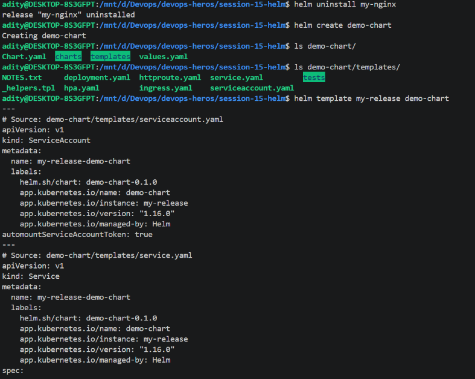
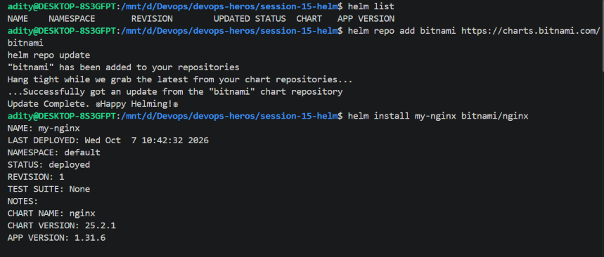
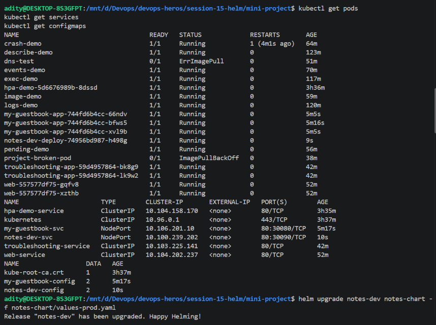
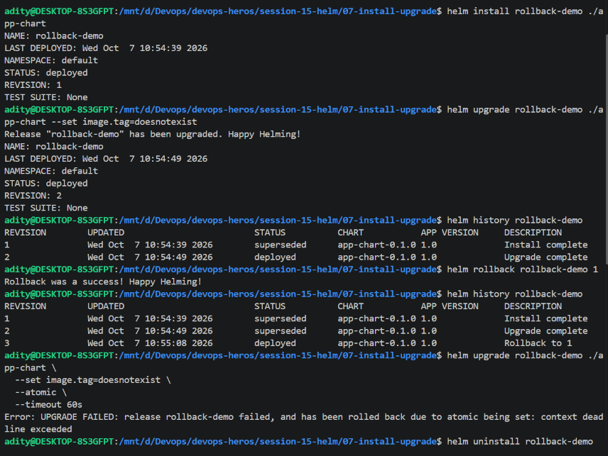
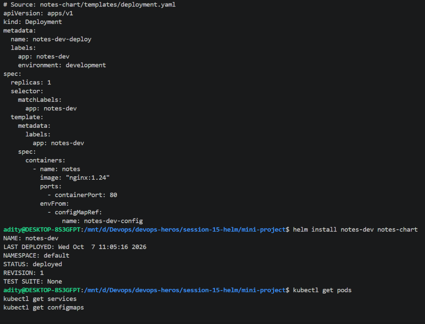
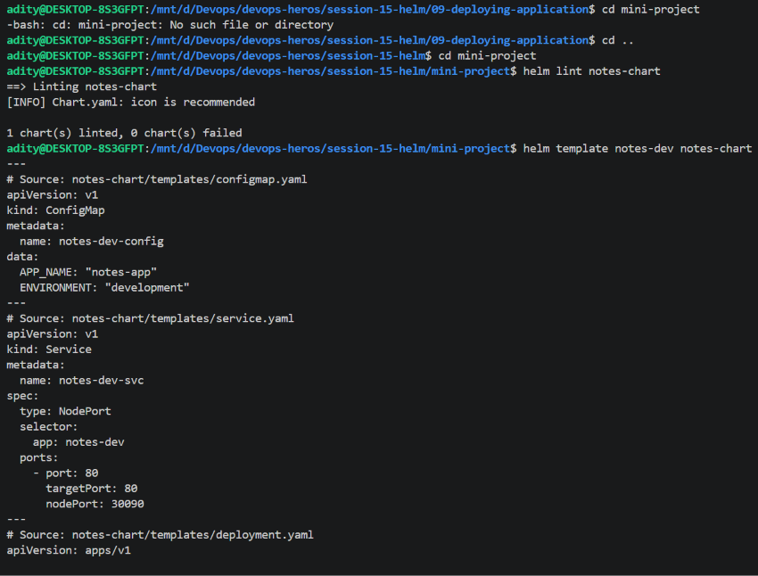
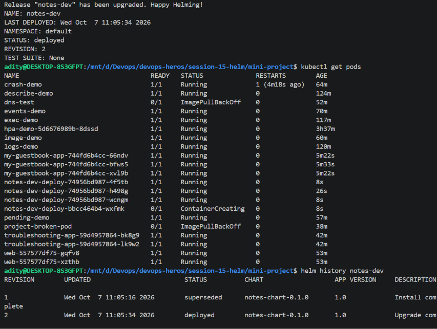
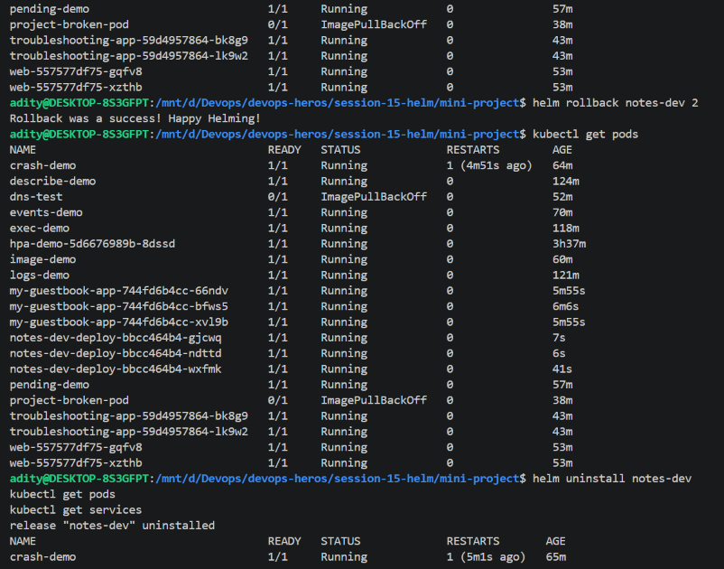
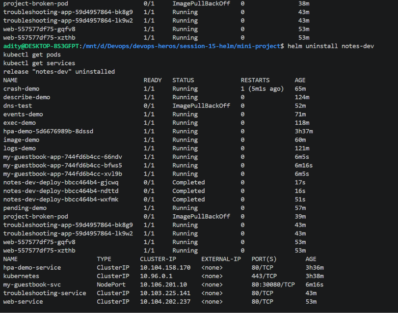
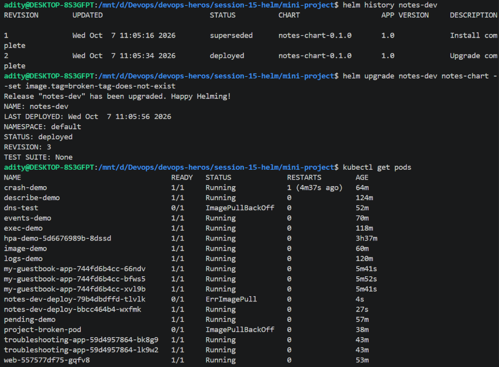

# Session 15: Helm

Helm is a package manager for Kubernetes. A **chart** contains templates and default values; installing a chart creates a **release**. Release revisions record installs, upgrades, and rollbacks so a deployment can be inspected and reverted.

## 1. Helm commands

The examples below use the commands captured during the session. Commands that change a cluster act on the current Kubernetes context and namespace; check `kubectl config current-context` and pass `--namespace` / `--create-namespace` where appropriate before running them.

### `helm create`

Scaffolds a new chart directory with `Chart.yaml`, `values.yaml`, starter templates, and tests. Review and adapt the generated resources before installing.

```sh
helm create demo-chart
ls demo-chart/
ls demo-chart/templates/
helm template my-release demo-chart
```

The captured output shows `Chart.yaml`, `charts/`, `templates/`, and `values.yaml`; `helm template` rendered Kubernetes resources locally without installing them.



### `helm install`

Creates a new release from a local chart or repository chart. The release name is the identifier used by later `status`, `upgrade`, `history`, `rollback`, and `uninstall` commands.

```sh
helm install my-nginx bitnami/nginx
helm install notes-dev ./mini-project/notes-chart
```

The recorded Bitnami install deployed release `my-nginx`, chart `nginx` version `25.2.1`, app version `1.31.6`, at revision 1. The mini project installs `notes-dev` from the local chart.



### `helm list`

Lists releases in the selected namespace. By default, it shows deployed releases; `-A` includes all namespaces.

```sh
helm list
helm list -A
helm list --all
```

An empty table means no releases match the selected namespace and filters; it does not mean Helm is unavailable.

### `helm status`

Shows a release's deployment state, revision, chart metadata, and chart-provided notes.

```sh
helm status notes-dev
helm status notes-dev --show-resources
```

Use it after installation, upgrade, or rollback to confirm the release state and review any chart-specific access instructions.

### `helm get`

Retrieves information rendered or stored for a release. Common subcommands include `values`, `manifest`, `notes`, and `all`.

```sh
helm get values notes-dev
helm get values notes-dev --all
helm get manifest notes-dev
helm get notes notes-dev
helm get all notes-dev
```

Use `--all` with `get values` to include chart defaults as well as release overrides. The manifest is useful for comparing what Helm submitted with the live objects.

### `helm upgrade`

Changes an existing release to a new chart revision. Supply the same release name and chart, then provide changed values with `--set` or a values file.

```sh
helm upgrade notes-dev ./mini-project/notes-chart --set replicaCount=3
helm upgrade notes-dev ./mini-project/notes-chart -f ./mini-project/notes-chart/values.yaml
```

Use `--install` when a command should install the release if it does not exist. Use `--atomic` to automatically roll back a failed upgrade; an atomic upgrade can still fail, for example if it times out waiting for Pods.

### `helm history`

Lists revisions for a release, including status and descriptions. Use the revision number to select the target of a rollback.

```sh
helm history notes-dev
helm history notes-dev --max 10
```

The screenshots show revision 1 as the original install and revision 2 as an upgrade before rollback.

### `helm rollback`

Restores the release configuration of a prior revision. A rollback itself creates a new revision; it does not erase the intervening history.

```sh
helm rollback notes-dev 2
helm history notes-dev
helm status notes-dev
```

The mini-project rollback targeted revision 2 after revision 3 introduced a bad image tag. Verify both the Helm release and the resulting Pods.

### `helm uninstall`

Removes a release and its Helm-managed resources from the selected namespace.

```sh
helm uninstall notes-dev
helm list
```

Uninstalling deletes the release's managed Kubernetes resources; it does not normally delete the chart source directory. Check data-retention implications before removing a release that uses persistent storage.

### `helm repo`

Manages chart repository definitions and their local indexes.

```sh
helm repo add bitnami https://charts.bitnami.com/bitnami
helm repo update
helm repo list
helm repo remove bitnami
```

The captured output shows the Bitnami repository being added and successfully updated. Repository metadata must be refreshed to discover newly published chart versions.

### `helm search`

Searches chart repositories already added to Helm. `repo` searches configured repository indexes; `hub` searches Artifact Hub.

```sh
helm search repo nginx
helm search repo bitnami/nginx --versions
helm search hub nginx
```

The screenshot installs `bitnami/nginx` after adding and updating the Bitnami repository.


## 2. Helm rollback workflow

The workflow below is the one captured in the mini-project: install a working release, make a valid upgrade, verify it, introduce a bad image in a later upgrade, then roll back to the known-good revision and verify recovery.

### Install — revision 1

```sh
helm install notes-dev ./mini-project/notes-chart
helm status notes-dev
kubectl get pods
```

The initial release used one replica and the working `nginx:1.24` image. The install output reported `STATUS: deployed` and `REVISION: 1`.

### Upgrade — revision 2

```sh
helm upgrade notes-dev ./mini-project/notes-chart --set replicaCount=3
helm status notes-dev
kubectl get pods
```

The valid upgrade set the release to three replicas. The captured output shows revision 2 deployed and three `notes-dev` Pods running.

### Verify the upgrade

```sh
helm history notes-dev
helm get values notes-dev
kubectl get deployment,service,configmap
kubectl get pods
```

The history showed revision 1 as `superseded` and revision 2 as `deployed`.

### Upgrade again with a bad image — revision 3

```sh
helm upgrade notes-dev ./mini-project/notes-chart \
  --set image.tag=tag-does-not-exist
helm history notes-dev
kubectl get pods
```

This deliberately introduced an invalid image tag for the rollback exercise. The captured output shows revision 3 deployed by Helm, while a new Pod entered `ErrImagePull`. A Helm upgrade being recorded as deployed does not by itself prove that every workload Pod is healthy; inspect Kubernetes rollout and Pod status too.

### Roll back to revision 2

```sh
helm rollback notes-dev 2
helm history notes-dev
helm status notes-dev
kubectl get pods
```

Helm reported a successful rollback. The captured post-rollback output shows the `notes-dev` Pods returning to `Running`. The history retains the failed-image revision and adds a new deployed rollback revision.

The screenshots also show a separate `rollback-demo` exercise where an upgrade with `--atomic --timeout 60s` failed with a context deadline and Helm automatically rolled it back. An automatic rollback is useful protection, but investigate readiness and events to determine why the upgrade timed out.





## 3. Mini project: NGINX notes release

The local chart is in [`mini-project/notes-chart/`](mini-project/notes-chart/). It packages a small NGINX Deployment, a NodePort Service, and a ConfigMap. The default chart values provide one replica, image `nginx:1.24`, application name `notes-app`, and environment `development`.

### Chart structure

```text
mini-project/
└── notes-chart/
    ├── Chart.yaml
    ├── values.yaml
    └── templates/
        ├── configmap.yaml
        ├── deployment.yaml
        └── service.yaml
```

### Lint and render

```sh
helm lint ./mini-project/notes-chart
helm template notes-dev ./mini-project/notes-chart
```

The captured lint result was `1 chart(s) linted, 0 chart(s) failed`. The rendered manifest shows the ConfigMap, NodePort Service, and Deployment. The Service used port 80 and NodePort 30090.



### Install and inspect

```sh
helm install notes-dev ./mini-project/notes-chart
helm status notes-dev
kubectl get pods
kubectl get services
kubectl get configmaps
```

The recorded release installed as revision 1. The screenshot shows the `notes-dev` Pod, Service, and ConfigMap.



### Upgrade and rollback

```sh
helm upgrade notes-dev ./mini-project/notes-chart --set replicaCount=3
helm history notes-dev
helm upgrade notes-dev ./mini-project/notes-chart \
  --set image.tag=tag-does-not-exist
kubectl get pods
helm rollback notes-dev 2
helm status notes-dev
kubectl get pods
```

Revision 2 is the known-good three-replica release; the following upgrade deliberately uses a missing image tag. Roll back to revision 2, then confirm the release and Pods are healthy.







The mini project was removed after verification:

```sh
helm uninstall notes-dev
helm list
```

The screenshot shows Helm reporting `release "notes-dev" uninstalled`.



## 4. Reference: generated starter chart

The session also generated a separate starter chart with Helm's scaffolder, inspected its directory and `templates/`, rendered it, and then uninstalled the `my-nginx` sample release.

```sh
helm create demo-chart
helm template my-release demo-chart
helm install my-nginx bitnami/nginx
helm list
helm uninstall my-nginx
```

The generated chart is a learning scaffold; the maintained mini-project chart is [`mini-project/notes-chart/`](mini-project/notes-chart/).


