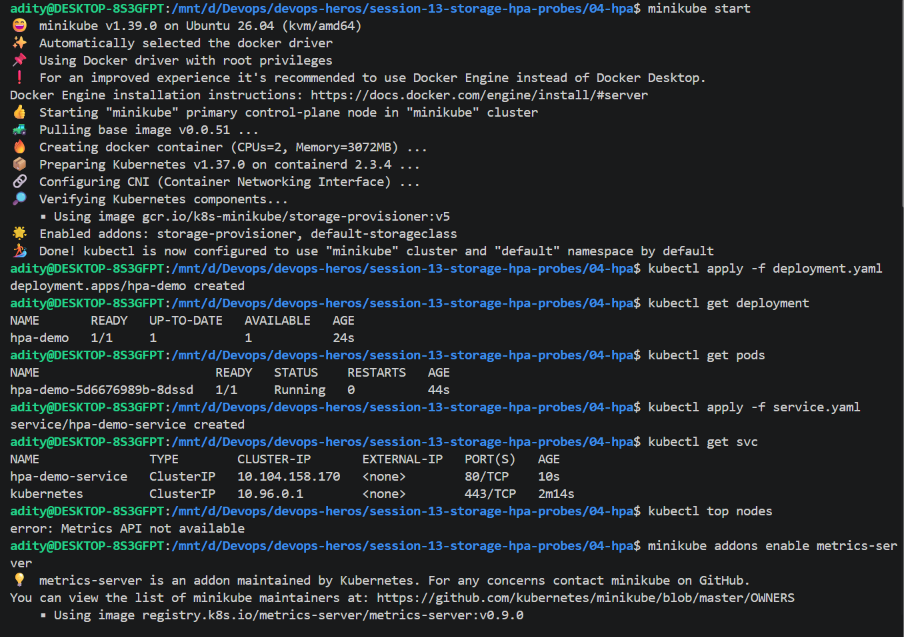
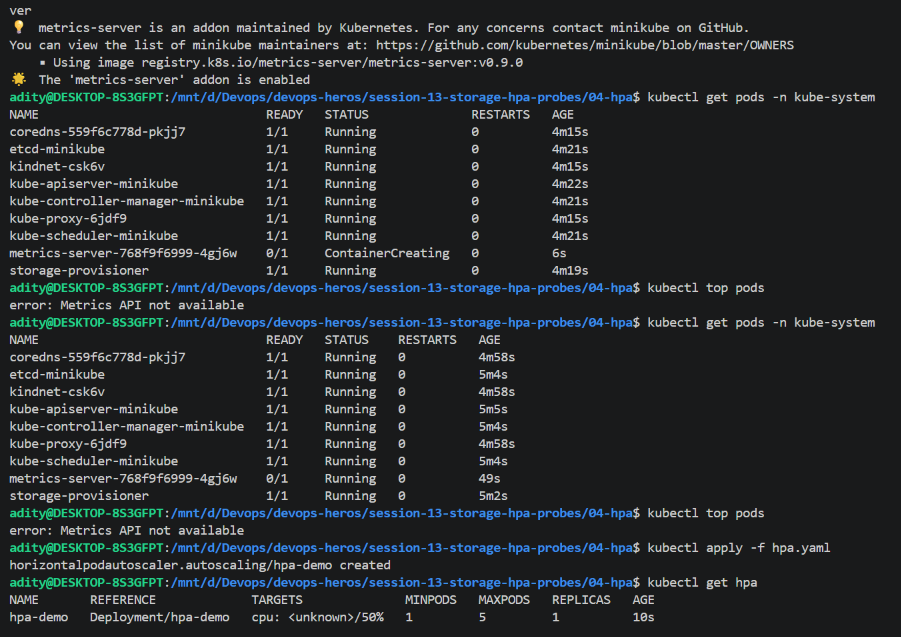
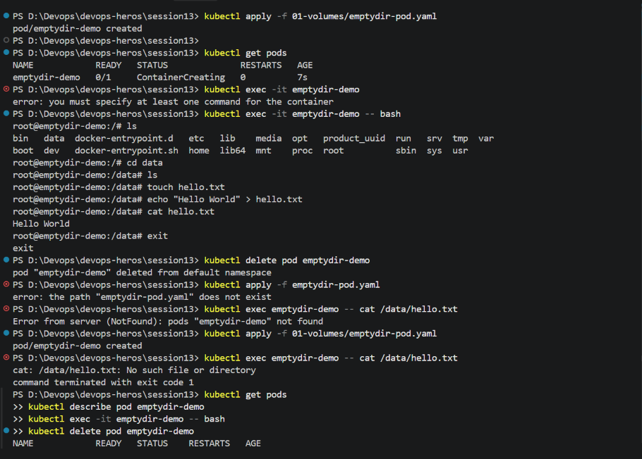
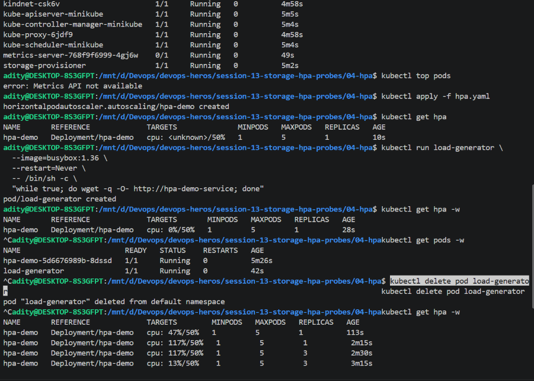
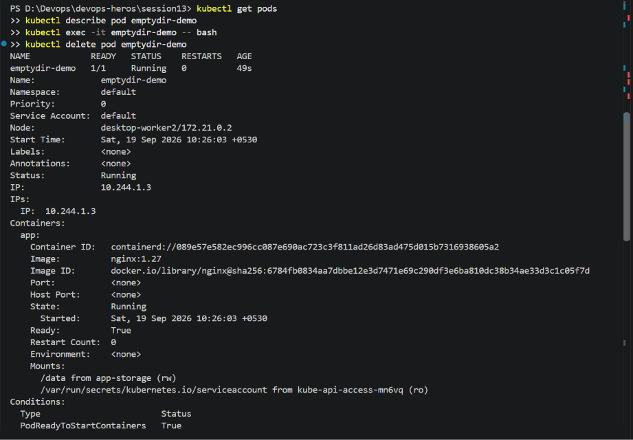
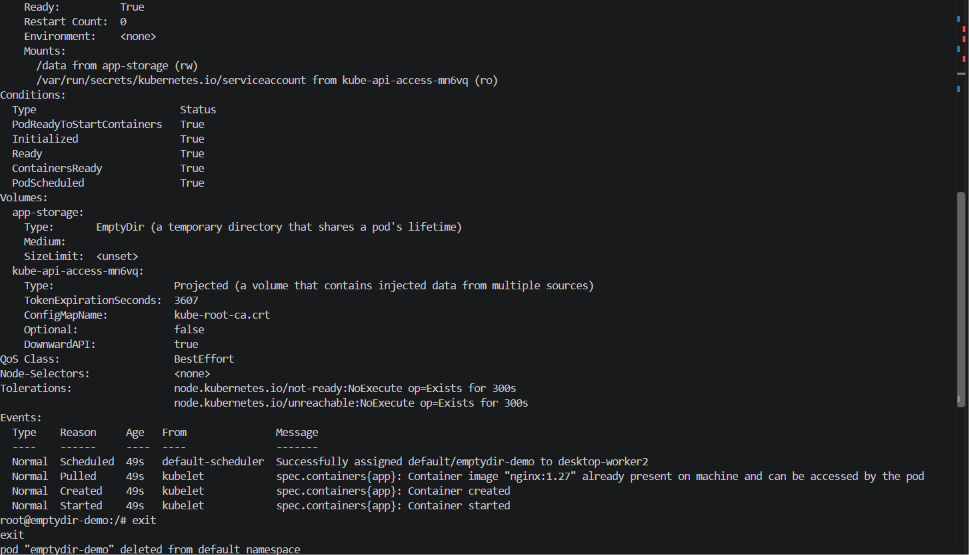
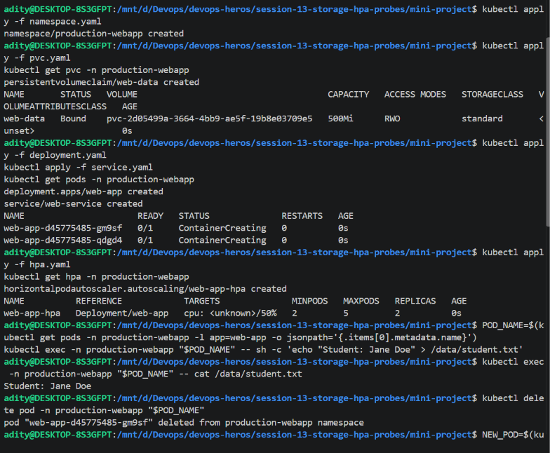
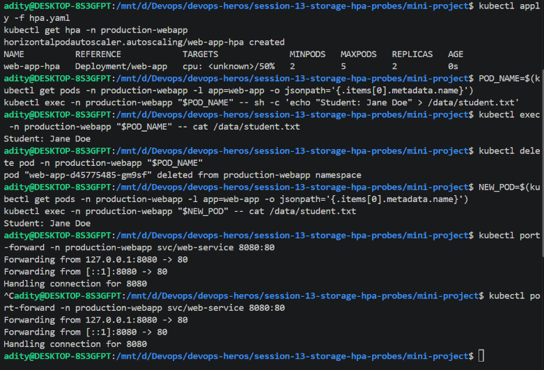
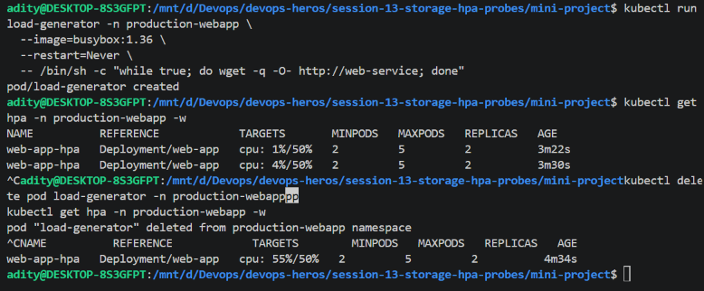
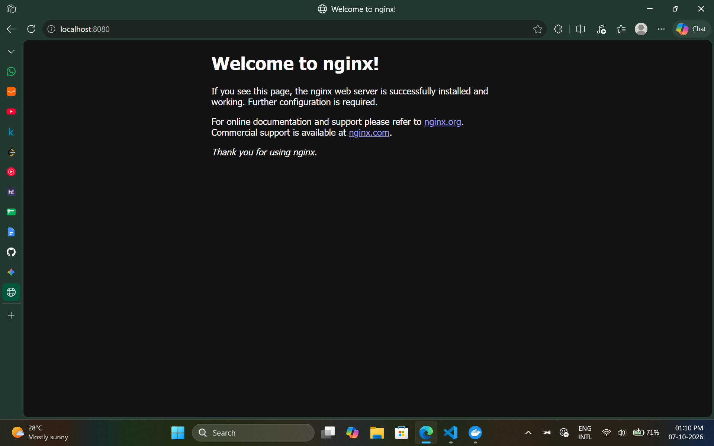

# Session 13: Kubernetes Storage, HPA, and Probes

This session covers Kubernetes volume types and persistent storage, horizontal pod autoscaling, and a small web application that combines a PVC with an HPA. The screenshots below are the captured hands-on evidence.

## 1. Kubernetes volumes

Containers have an ephemeral writable layer. Data written only into that layer is lost when the container is replaced. A Kubernetes volume makes data available to a container at a mount path; its lifetime and persistence depend on the volume type.

### `emptyDir`

An `emptyDir` is created when a Pod is assigned to a node. It is initially empty, can be mounted by multiple containers in that Pod, and remains available across a container restart while the Pod remains on the node. It is deleted when the Pod is removed. It is useful for scratch space, caches, or sharing temporary files between containers, but not for data that must outlive the Pod.

Example Pod fragment:

```yaml
spec:
  containers:
    - name: app
      image: nginx:1.27
      volumeMounts:
        - name: scratch
          mountPath: /data
  volumes:
    - name: scratch
      emptyDir: {}
```

The hands-on example mounted the volume at `/data`, wrote `hello.txt`, and read it back from inside the container. After deleting the Pod, the replacement Pod had a new, empty `emptyDir`; the previous file was no longer present.

### `hostPath`

A `hostPath` mounts a path from the Kubernetes node's filesystem into a Pod. Unlike `emptyDir`, the data can remain on that node after a Pod is removed, but it is tied to that specific node. Scheduling the Pod elsewhere can expose a different directory or no data at all. It also gives a Pod access to node files, so it should be used sparingly and with carefully restricted paths and permissions. It is generally not a portable application-storage solution.

Example fragment (the path is on the node, not on the user's workstation):

```yaml
volumes:
  - name: node-data
    hostPath:
      path: /var/local/app-data
      type: DirectoryOrCreate
```

### PersistentVolume (`PV`)

A `PersistentVolume` is a cluster resource representing storage provisioned by an administrator or by a storage provisioner. It exists independently of an individual Pod and describes properties such as capacity, access modes, storage class, and reclaim policy. A PV may represent a cloud disk, network file share, or local storage, depending on the cluster and provisioner.

### PersistentVolumeClaim (`PVC`)

A `PersistentVolumeClaim` is a namespaced request for storage made by a workload. It asks for properties such as capacity, access mode, and optionally a StorageClass. Kubernetes binds it to a suitable PV, and a Pod refers to the claim rather than directly selecting the underlying storage.

Example claim and Pod reference:

```yaml
apiVersion: v1
kind: PersistentVolumeClaim
metadata:
  name: app-data
spec:
  accessModes:
    - ReadWriteOnce
  resources:
    requests:
      storage: 500Mi
  storageClassName: standard
```

```yaml
spec:
  containers:
    - name: app
      image: nginx:1.27
      volumeMounts:
        - name: app-data
          mountPath: /data
  volumes:
    - name: app-data
      persistentVolumeClaim:
        claimName: app-data
```

`ReadWriteOnce` generally allows read-write mounting from one node; it does not necessarily mean only one Pod can use the volume. Supported access modes and their exact behavior depend on the storage backend.

### StorageClass and dynamic provisioning

A `StorageClass` describes how a cluster provisions a particular kind of storage. It identifies a provisioner and can define backend-specific parameters, reclaim policy, and volume-binding behavior. A cluster may designate a default StorageClass; the mini project used the `standard` class supplied by the local Minikube environment.

With **dynamic provisioning**, a PVC names a StorageClass and requests capacity; the provisioner creates the backing storage and PV automatically. Without dynamic provisioning, an administrator must create a matching PV in advance (static provisioning). This separates an application's storage request from the details of a specific storage backend.

### Volume exercise evidence

The exercise demonstrates the temporary lifetime of `emptyDir`: create the Pod, write and read a file from its mounted directory, then delete the Pod and observe that the file is not in the new Pod.







## 2. Horizontal Pod Autoscaler (HPA) hands-on

The HPA adjusts the number of replicas for a scalable workload, such as a Deployment, in response to observed metrics. In this exercise, the `hpa-demo` Deployment was autoscaled on CPU utilization with a 50% target, a minimum of 1 replica, and a maximum of 5. CPU utilization is calculated relative to the containers' CPU requests, so CPU requests need to be configured for meaningful utilization-based scaling.

### Steps and useful commands

1. Start the local cluster and make sure the metrics API is available. The screenshots show Minikube's Metrics Server add-on being enabled.
2. Deploy the application and its Service, then apply the HPA configuration (the screenshot used `hpa.yaml`).
3. Check the HPA and Pods, and start a BusyBox load generator that repeatedly requests the application Service:

   ```sh
   kubectl get hpa
   kubectl get pods
   kubectl top pods
   kubectl describe hpa hpa-demo

   kubectl run load-generator \
     --image=busybox:1.36 \
     --restart=Never \
     -- /bin/sh -c 'while true; do wget -q -O- http://hpa-demo-service; done'
   ```

4. Observe the HPA and Pods as metrics are collected and replicas change:

   ```sh
   kubectl get hpa -w
   kubectl get pods -w
   ```

5. Stop the load generator when finished. HPA reconciliation is asynchronous, so allow time for metrics collection and scaling before drawing conclusions from a single sample.

### Captured observations

The screenshots show the HPA initially reporting CPU as `<unknown>/50%` while metrics were not yet available. `kubectl top pods` returned `Metrics API not available` during startup. After metrics became available, the HPA reported CPU samples of `47%/50%` and `117%/50%`; the replica count later reached 3 (within the configured maximum of 5). A later sample showed `13%/50%` while 3 replicas were still present. HPA decisions and scale-down take time, so the displayed value and replica count need not change in the same polling interval.

Representative rows transcribed from the captured `kubectl get hpa -w` output:

```text
NAME       REFERENCE            TARGETS       MINPODS   MAXPODS   REPLICAS
hpa-demo   Deployment/hpa-demo  <unknown>/50% 1         5         1
hpa-demo   Deployment/hpa-demo  47%/50%       1         5         1
hpa-demo   Deployment/hpa-demo  117%/50%      1         5         1
hpa-demo   Deployment/hpa-demo  13%/50%       1         5         3
```

The sequence is a set of asynchronous snapshots, not a promise of immediate scaling for each row. If metrics remain unavailable, check that the Metrics Server is running and retry `kubectl top pods` after it has had time to collect data.







## 3. Mini project: persistent web data with autoscaling

The mini project deploys a web application into the `production-webapp` namespace, exposes it through the `web-service` Service, mounts a PVC named `web-data`, and configures an HPA for the `web-app` Deployment.

### Implementation and verification

- The `web-data` PVC requested `500Mi` with `ReadWriteOnce` access and the `standard` StorageClass. The captured `kubectl get pvc` output showed it `Bound` to a dynamically provisioned PV.
- The `web-app` Deployment was created with two replicas, and `web-service` exposed the application on port 80.
- The HPA targeted 50% CPU utilization with a minimum of 2 replicas and a maximum of 5.
- A file containing `Student: Jane Doe` was written to `/data/student.txt` in a Pod. After deleting that Pod, the replacement Pod read the same contents from the mounted claim. This verifies that the application data outlived the original Pod.
- A BusyBox load generator repeatedly requested `http://web-service`. The captured HPA output showed utilization samples of `1%/50%`, `4%/50%`, and `55%/50%`; the replica count shown remained 2 in those snapshots.
- The Service was also port-forwarded locally on port 8080 to check connectivity.

Useful checks for this project:

```sh
kubectl get pvc -n production-webapp
kubectl get pods -n production-webapp
kubectl get hpa -n production-webapp
kubectl describe hpa web-app-hpa -n production-webapp
kubectl top pods -n production-webapp
kubectl port-forward -n production-webapp svc/web-service 8080:80
```









## 4. Probe concepts

Probes help Kubernetes manage container health; they complement, but do not replace, an HPA:

- A **startup probe** gives a slow-starting application time to initialize. While it has not succeeded, Kubernetes does not run the liveness or readiness probes.
- A **liveness probe** detects a container that is stuck and can cause Kubernetes to restart it.
- A **readiness probe** reports whether a container is ready to receive traffic. An unready Pod is removed from the ready endpoints used by Services, but is not automatically restarted just for being unready.

For an HTTP application, a probe can check an endpoint such as `/health`. Configure its initial delay, period, timeout, and failure threshold to match the application's startup and recovery behavior; an overly aggressive liveness check can cause unnecessary restart loops.
