# Session 14: Kubernetes Troubleshooting

This session practices common `kubectl` inspection commands and uses Pod status, container logs, and Kubernetes events to diagnose workload and connectivity problems. Screenshots are included as evidence. Where a screenshot does not show a completed fix, the notes below describe the diagnostic procedure rather than claiming the issue was reproduced or resolved.

## 1. Kubernetes troubleshooting commands

Start by identifying the namespace and resource, then gather progressively more detailed evidence. Add `-n <namespace>` to commands when the resource is not in the current namespace; use `-A` to inspect all namespaces.

### `kubectl get`

Lists resources and their current summary status. Use it to spot Pods that are not ready, recent restarts, or missing resources.

```sh
kubectl get pods
kubectl get deployments,services
kubectl get all
kubectl get pods -A
```

The captured output lists the Pod, Service, Deployment, ReplicaSet, and HPA resources in the practice cluster.

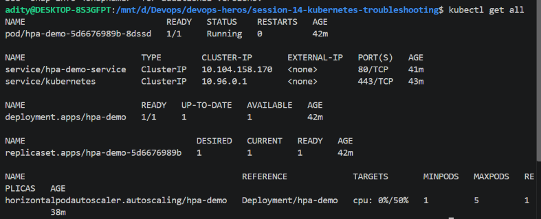

### `kubectl describe`

Shows the selected resource's configuration, status, conditions, and recent events. For a Pod, the **Events** section often explains why it is Pending, cannot pull an image, or is restarting.

```sh
kubectl describe pod <pod-name>
kubectl describe deployment <deployment-name>
kubectl describe service <service-name>
```

The Pod description screenshot shows the container state and normal scheduling, image-pull, creation, and start events.

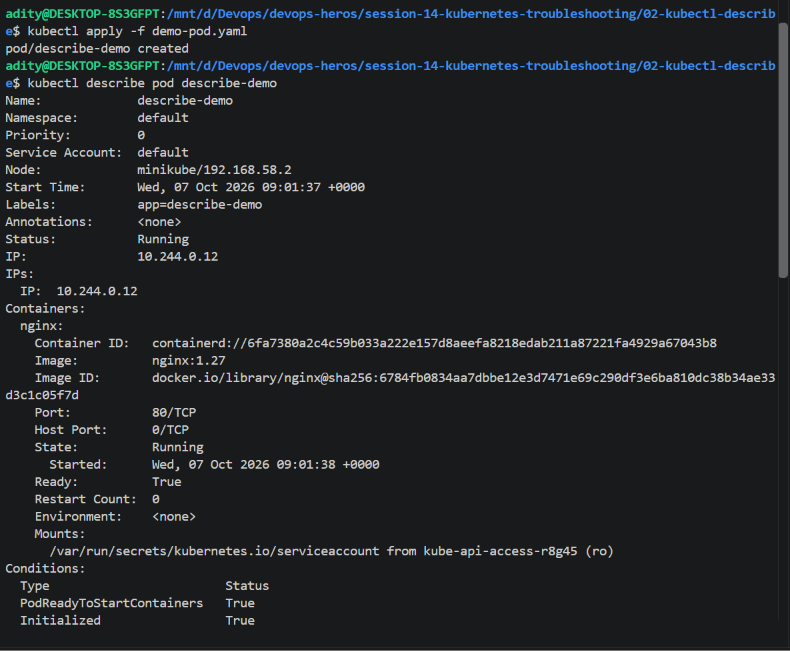

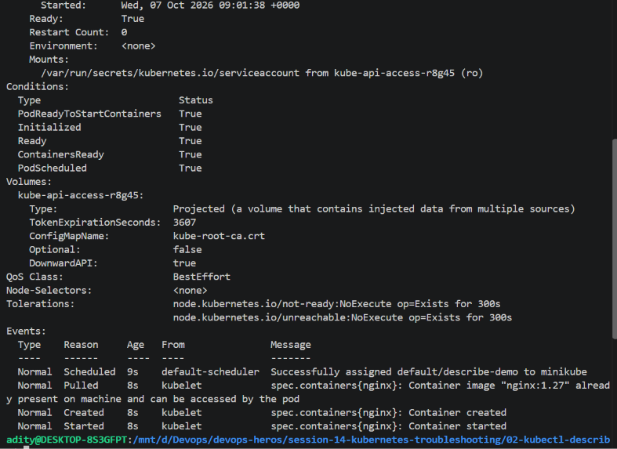

### `kubectl logs`

Reads the container's standard output and standard error. For a restarting container, `--previous` requests logs from its last terminated instance, which are often more useful than logs from the current restart.

```sh
kubectl logs <pod-name>
kubectl logs <pod-name> -c <container-name>
kubectl logs <pod-name> --previous
kubectl logs -f <pod-name>
```

The captured application logs show startup and health messages.

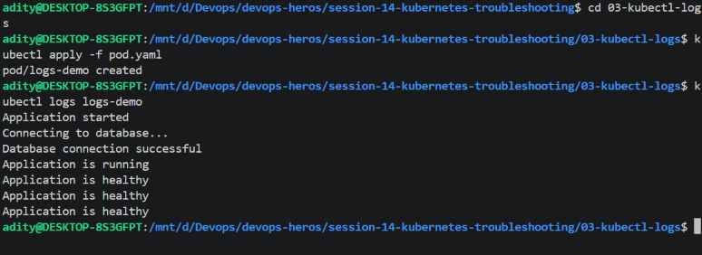

### `kubectl exec`

Runs a command in a running container for focused inspection. The container must be running; `exec` will not work on a Pod stuck waiting for an image or one that has already exited.

```sh
kubectl exec -it <pod-name> -- sh
kubectl exec <pod-name> -- ls -la /usr/share/nginx/html
```

The screenshot lists the files in the NGINX document root from inside the container.

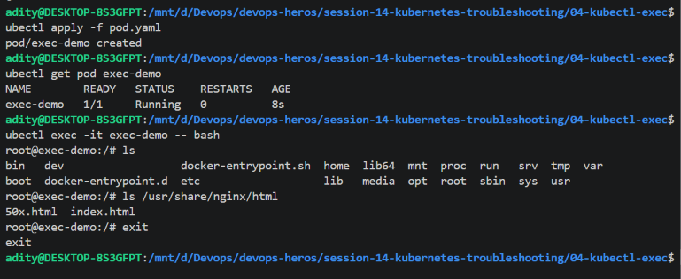

### `kubectl events`

Events report cluster actions and warnings such as scheduling decisions, failed image pulls, probe failures, and autoscaler activity. Events are time-limited, so collect them while the issue is happening.

```sh
kubectl events
kubectl events --for pod/<pod-name>
kubectl get events --sort-by=.metadata.creationTimestamp
```

The event output includes Pod scheduling and startup, plus HPA metric and scaling events.


### `kubectl explain`

Looks up the Kubernetes API schema and field documentation locally. It is useful for checking valid field names and where a field belongs before changing a manifest.

```sh
kubectl explain pod
kubectl explain pod.spec
kubectl explain pod.spec.containers
kubectl explain deployment.spec.template.spec
```

### `kubectl top`

Displays recent resource metrics if a Metrics Server is installed and ready. It is useful for checking CPU or memory pressure, but it does not replace logs or events.

```sh
kubectl top nodes
kubectl top pods
kubectl top pods --containers
```

If the command reports that the Metrics API is unavailable, verify that the Metrics Server is installed and healthy, then retry after it has collected metrics. The captured HPA events also show a temporary `FailedGetResourceMetric` while the metrics API could not serve a Pod metrics request; later HPA events show a successful scale-up and scale-down.

### `kubectl get -o wide`

Adds placement and network details such as Pod IP and node to the usual resource summary. It helps compare where Pods are scheduled and identify their addresses during network investigations.

```sh
kubectl get pods -o wide
kubectl get pods -A -o wide
kubectl get nodes -o wide
```

The mini-project output shows Pod IPs and the node hosting each Pod.

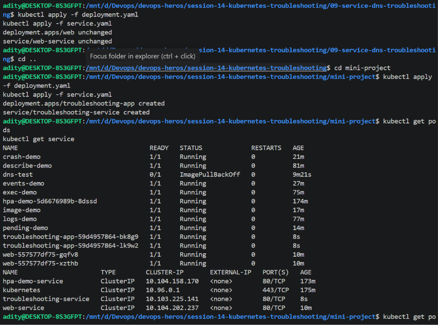

## 2. Troubleshoot common issues

Use the same workflow for each incident:

1. **Identify:** note the resource, namespace, status, and when the problem began.
2. **Investigate:** inspect `get`, `describe`, recent events, and logs where available.
3. **Find the cause:** connect a concrete error or failed condition to the workload configuration or cluster dependency.
4. **Fix:** change only the relevant image, command, selector, scheduling rule, or configuration.
5. **Verify:** check readiness, events, logs, endpoints, or a real request after the change.

### `CrashLoopBackOff`

**Problem and investigation:** The `crash-demo` container repeatedly terminated. `kubectl describe pod crash-demo` showed a terminated state with exit code `1` and BackOff events. `kubectl logs crash-demo` showed `Application starting...` followed by `Something went wrong!`; the configured shell command then exited with status 1.

**Root cause:** The example's container command deliberately reported an error and exited, so Kubernetes restarted it and progressively backed off.

**Solution and verification:** Replace the failing startup command with one that starts the application successfully, then recreate/update the Pod. The captured after-state shows `crash-demo` as `1/1 Running`, restart count `0`, with logs reporting `Application is healthy`.

```sh
kubectl get pod crash-demo
kubectl describe pod crash-demo
kubectl logs crash-demo --previous
kubectl logs crash-demo
```

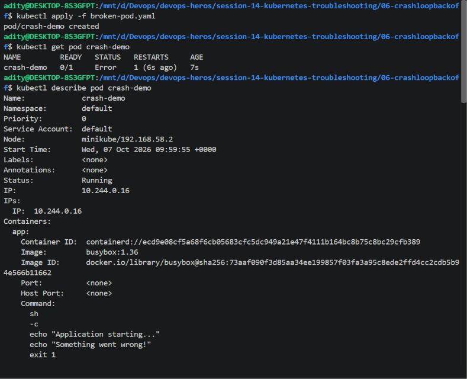

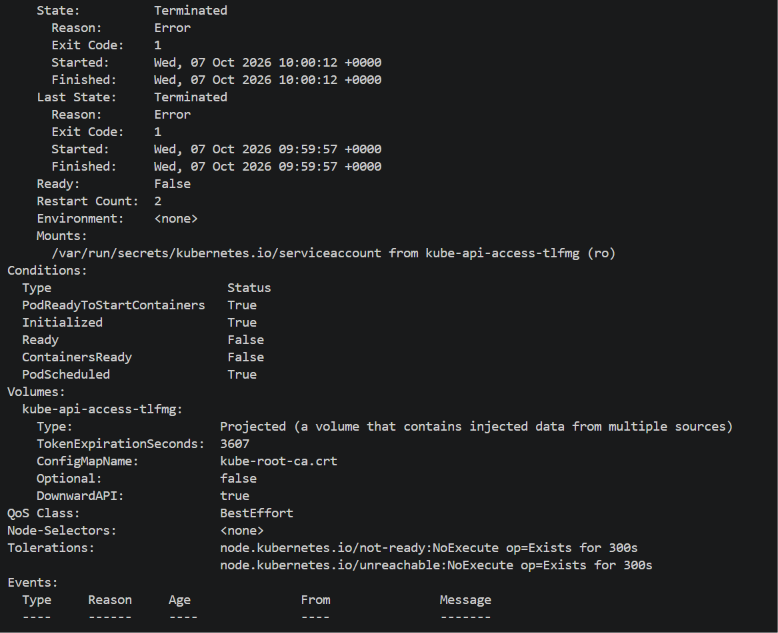

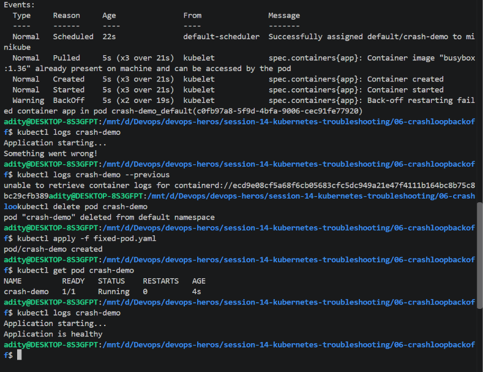

### `ErrImagePull` and `ImagePullBackOff`

These are related image-pull states. `ErrImagePull` reports a failed attempt; `ImagePullBackOff` means Kubernetes is retrying with increasing delays.

**Problem and investigation:** `image-demo` used `nginx:this-image-does-not-exist`. `kubectl describe pod image-demo` showed `ImagePullBackOff`; events reported `ErrImagePull` and that the requested image/tag could not be found.

**Root cause:** The image reference contained a nonexistent tag.

**Solution and verification:** Correct the image reference to a tag available from the registry, then recreate or roll out the workload. The captured after-state shows `image-demo` `1/1 Running` with no restarts.

```sh
kubectl get pods
kubectl describe pod image-demo
kubectl get events --sort-by=.metadata.creationTimestamp
```

The same failure was reproduced in the mini project with `nginx:this-tag-does-not-exist`; its Pod description confirms the failed pull.

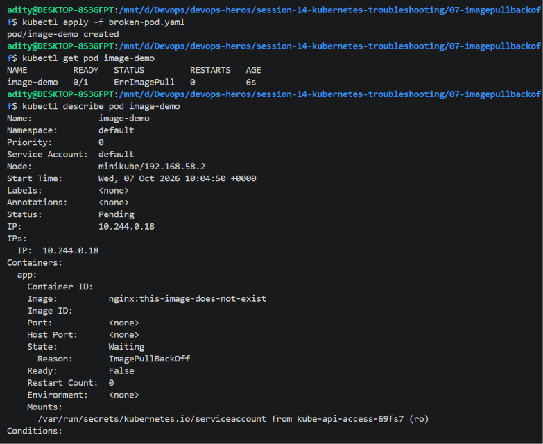

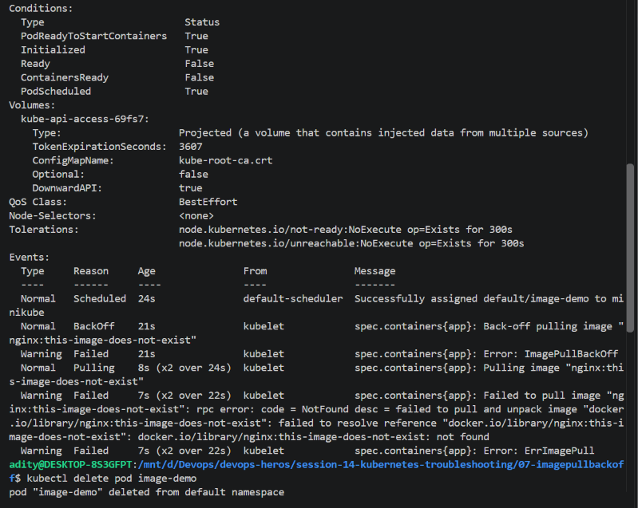

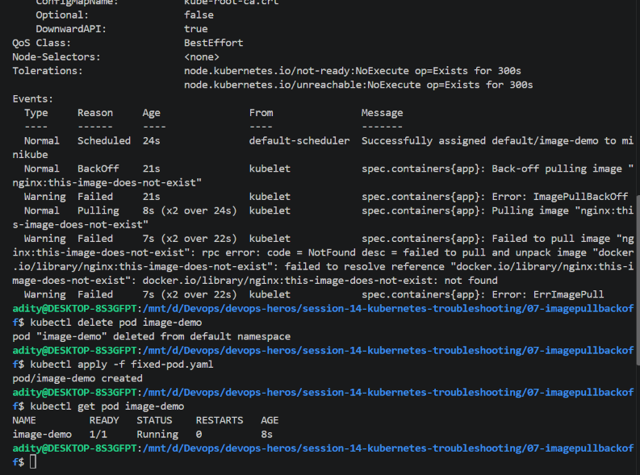

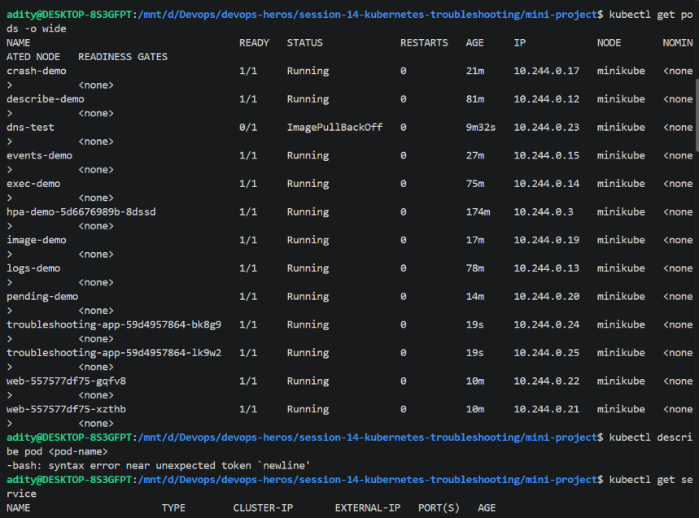

### `Pending`

**Problem and investigation:** `pending-demo` remained Pending. The scheduler event reported that the only node did not match the Pod's node affinity/selector: `0/1 nodes are available`.

**Root cause:** The scheduling rule selected a node label that no available node had.

**Solution and verification:** Remove the unnecessary node selector/affinity or change it to match labels on an eligible node. Confirm with `kubectl get nodes --show-labels`, then inspect the recreated Pod. The captured after-state shows `pending-demo` `1/1 Running`.

```sh
kubectl get pod pending-demo
kubectl describe pod pending-demo
kubectl get nodes --show-labels
```

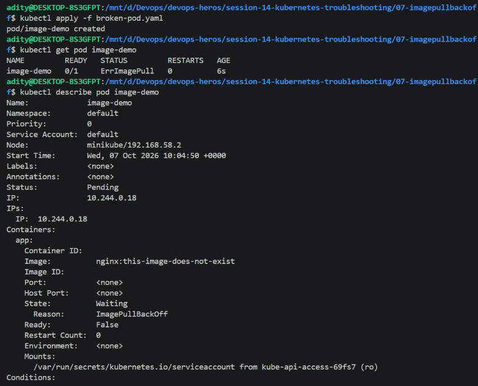

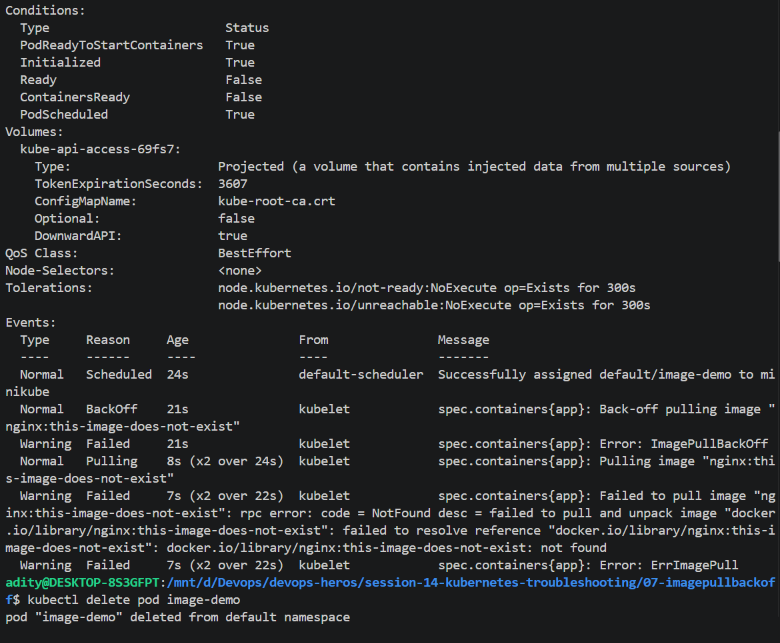

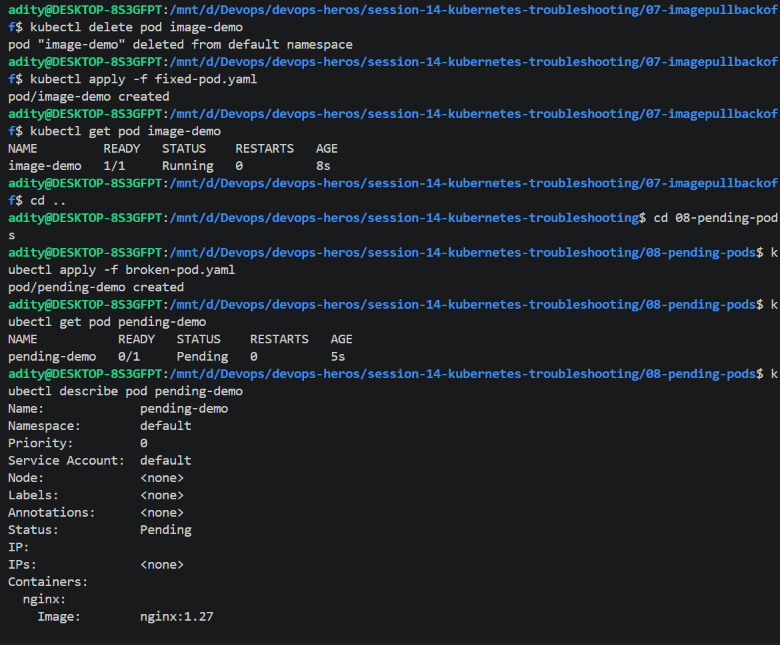

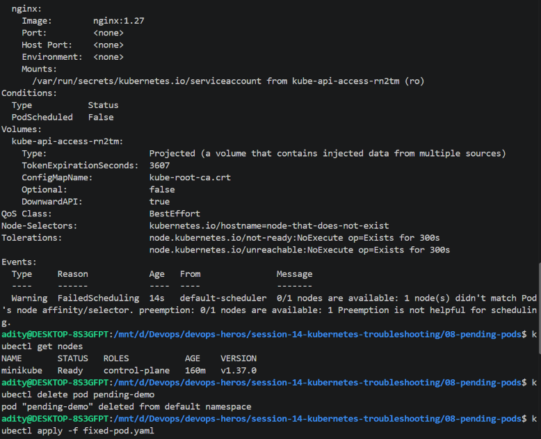

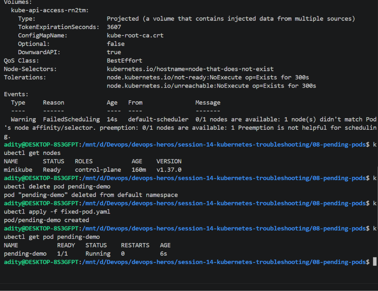

### `ContainerCreating`

`ContainerCreating` is a transitional state, not by itself a root cause. If it persists:

```sh
kubectl describe pod <pod-name>
kubectl get events --sort-by=.metadata.creationTimestamp
kubectl get pod <pod-name> -o wide
```

Read the latest Warning events and the Pod conditions. Depending on the event, investigate image pulls, volume/PVC attachment or mount errors, CNI/network setup, or node health. Resolve the specific reported cause and verify the Pod reaches Ready. No screenshot in this session records a persistent `ContainerCreating` failure, so this is a diagnostic checklist rather than a claimed hands-on fix.

### Service connectivity issues

A Service can exist and have a ClusterIP while still sending traffic to no Pods. Check that its selector matches labels on ready Pods, and that `port`/`targetPort` match the application container.

```sh
kubectl get service <service-name> -o yaml
kubectl describe service <service-name>
kubectl get pods --show-labels
kubectl get endpoints <service-name>
kubectl get endpointslices
```

One captured `web-service` inspection showed no endpoints at that point. Later mini-project output shows `troubleshooting-service` selecting `app=troubleshooting-app` with two Pod endpoints (`10.244.0.24:80` and `10.244.0.25:80`). This demonstrates checking endpoint membership, but the screenshots do not establish why the earlier `web-service` endpoint list was empty; check Pod readiness and selector/label matching before attributing a cause.

After endpoints exist, test from a client Pod using the Service DNS name, and verify the application is listening on the target port. If connectivity still fails, check NetworkPolicies and Pod/node networking.

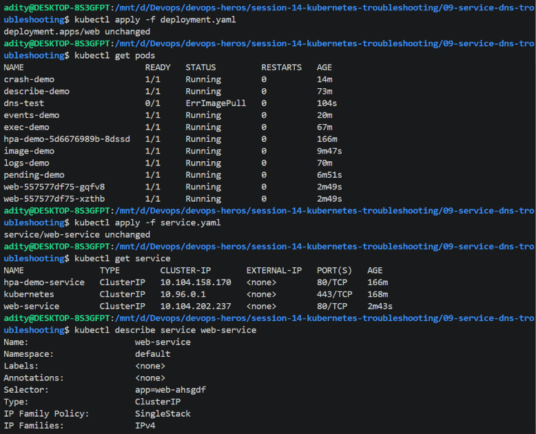

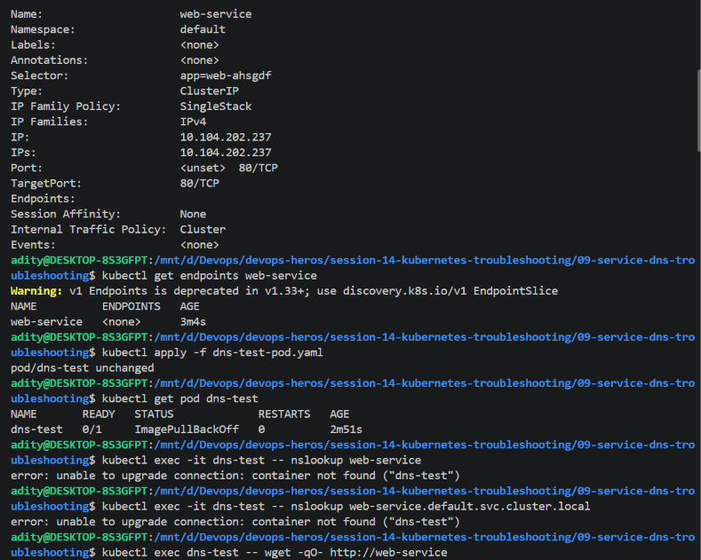

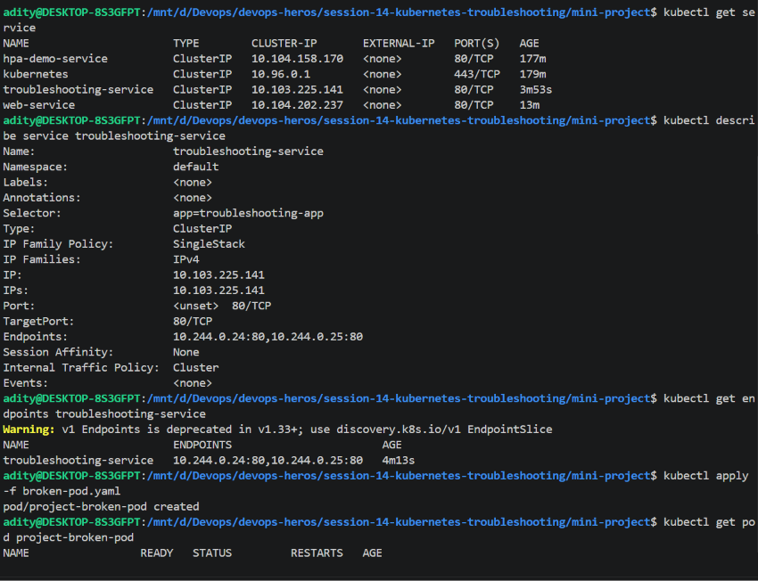

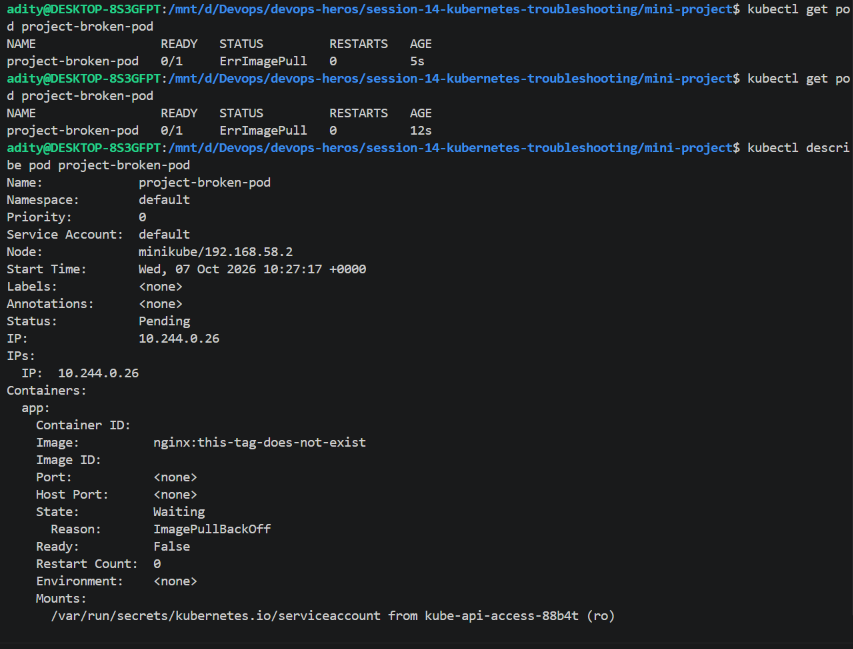

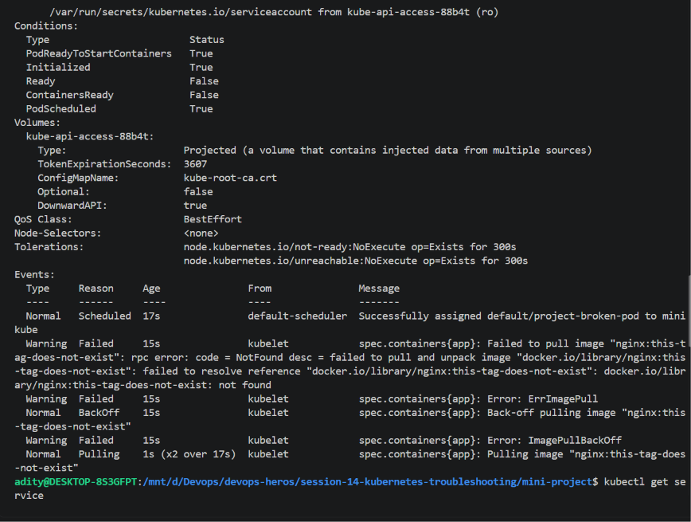

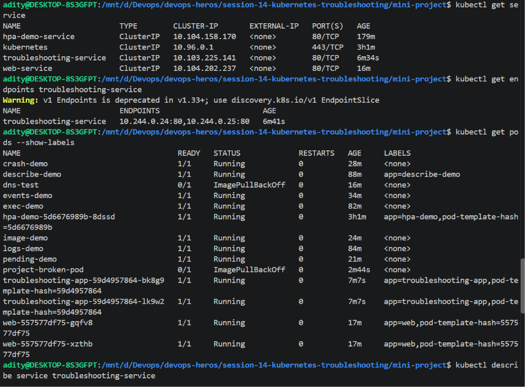

### DNS issues

Test DNS from a running Pod. Kubernetes Service names normally resolve within the cluster; a fully qualified Service name is `<service>.<namespace>.svc.cluster.local`.

```sh
kubectl exec <client-pod> -- nslookup kubernetes.default
kubectl exec <client-pod> -- nslookup <service-name>
kubectl exec <client-pod> -- nslookup <service-name>.<namespace>.svc.cluster.local
kubectl get pods -n kube-system
kubectl get service -n kube-system
```

If name lookup fails, first verify the target Service and namespace, then inspect the cluster DNS Pods and Service, followed by NetworkPolicies and CNI connectivity. The session's `dns-test` Pod was itself in `ImagePullBackOff`; `kubectl exec` failed because no container was running. Therefore DNS resolution was not actually verified in that screenshot. Correct the diagnostic Pod's image and wait for it to become Ready before using `nslookup` to draw a DNS conclusion.


### Pod networking issues

Separate Pod-to-Pod, Pod-to-Service, and external connectivity checks. Start with addresses, node placement, Service endpoints, and listening ports:

```sh
kubectl get pods -o wide
kubectl get service <service-name> -o wide
kubectl get endpoints <service-name>
kubectl describe pod <pod-name>
```

From a running diagnostic container, test the destination Pod IP and Service DNS/IP independently. If Pod-IP traffic fails, investigate node/CNI health and NetworkPolicies; if Pod-IP succeeds but Service traffic fails, focus on Service selectors, endpoints, and ports. The screenshots show the relevant Pod IP/node and Service endpoint inspection commands, but do not record a confirmed CNI or NetworkPolicy failure.

### Configuration issues

For a Pod that starts with unexpected settings or exits because configuration is absent or invalid, inspect the Pod's environment and mounts as well as the source ConfigMap or Secret. Confirm the referenced object and key exist in the same namespace, and that the application expects the configured key/path.

```sh
kubectl describe pod <pod-name>
kubectl get configmaps
kubectl describe configmap <configmap-name>
kubectl get secrets
kubectl describe secret <secret-name>
kubectl logs <pod-name> --previous
```

Correct the workload's reference or the configuration data, then restart/roll out the workload and verify its logs and readiness. Do not print Secret values into shared logs or documentation. No specific ConfigMap/Secret failure is shown in this session's screenshots; use the commands above to identify one before applying a fix.

## 3. Mini project: diagnose a web workload

The mini project deployed a two-replica `troubleshooting-app` and exposed it with the `troubleshooting-service` ClusterIP Service on port 80. A separate `project-broken-pod` reproduced an image-pull failure.

### Problem statement

The diagnostic Pod did not become ready, and the application Service needed verification. The mini-project screenshots show the diagnostic Pod requesting `nginx:this-tag-does-not-exist`, along with checks of running Pods, Services, and Service endpoints.

### Investigation and root cause

1. `kubectl get pods` showed `project-broken-pod` in `ErrImagePull`.
2. `kubectl describe pod project-broken-pod` showed `ImagePullBackOff` and an event that the image/tag could not be found.
3. `kubectl get services` and `kubectl describe service troubleshooting-service` showed the Service selector `app=troubleshooting-app` and two endpoints, confirming that the application Pods were selected and ready at the time of that check.
4. A separate earlier check showed no endpoints for `web-service`; endpoint health is time- and Service-specific, and the captured output does not prove the exact reason it was empty.

**Root cause for the broken Pod:** its image used the nonexistent `this-tag-does-not-exist` tag. The Service endpoint checks did not show a failure for `troubleshooting-service`; they showed two endpoints.

### Solution and verification

For the broken diagnostic Pod, use a valid image tag and recreate it. Verify that it reaches `Running` and `Ready` with `kubectl get pods`; inspect the Service's endpoints separately to confirm traffic has ready backend Pods. The screenshots show the broken Pod diagnosis and healthy application Service endpoints, but do not include an explicit after-state for `project-broken-pod`; the following output is representative of the verification commands, not transcribed output for a recorded fix:

```sh
kubectl get pods -o wide
kubectl get services
kubectl describe service troubleshooting-service
kubectl get endpoints troubleshooting-service
```

Captured mini-project output includes two running application Pods and the Service mapping to `10.244.0.24:80` and `10.244.0.25:80`.


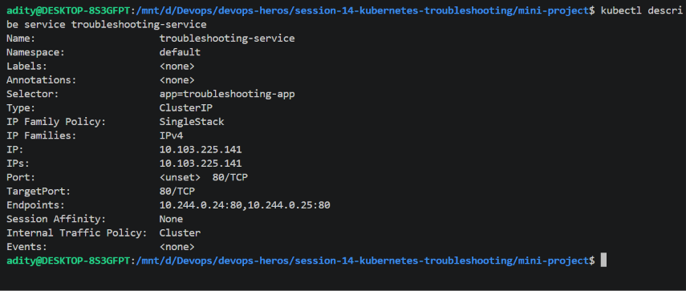

## 4. Key takeaways

- Pod status is a symptom; `describe` and events help identify the specific failure.
- Use `logs --previous` for a container that has already restarted.
- `ErrImagePull`/`ImagePullBackOff` point to image retrieval or reference issues; `CrashLoopBackOff` points to a container that repeatedly exits or fails liveness checks.
- A Pending Pod has not been scheduled; use scheduler events to inspect resource, affinity, taint, and node-selector constraints.
- A Service needs ready endpoints. Check selectors, labels, readiness, and ports before debugging DNS or the network data path.
- If a diagnostic Pod cannot start, fix that prerequisite before treating its failed `exec` or DNS command as evidence about the cluster.
