# Monitoring Demo

This demo uses Prometheus to collect and query metrics and Grafana to connect to Prometheus and display metric data.

## Prometheus

The screenshots show the Prometheus container starting, the metrics endpoint, and example PromQL queries. The `up` metric reports whether a Prometheus scrape target is reachable (`1` means up; `0` means down).

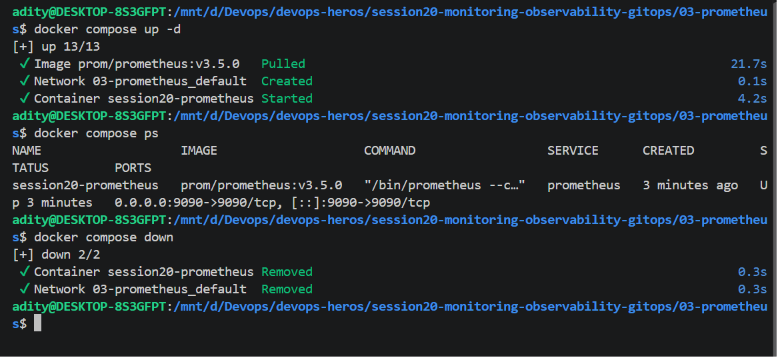
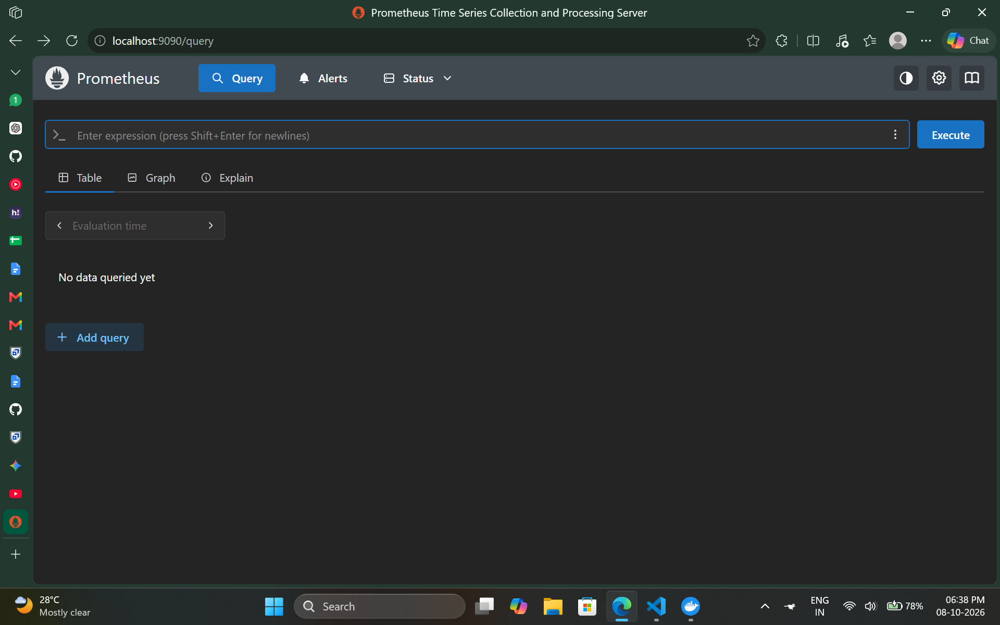
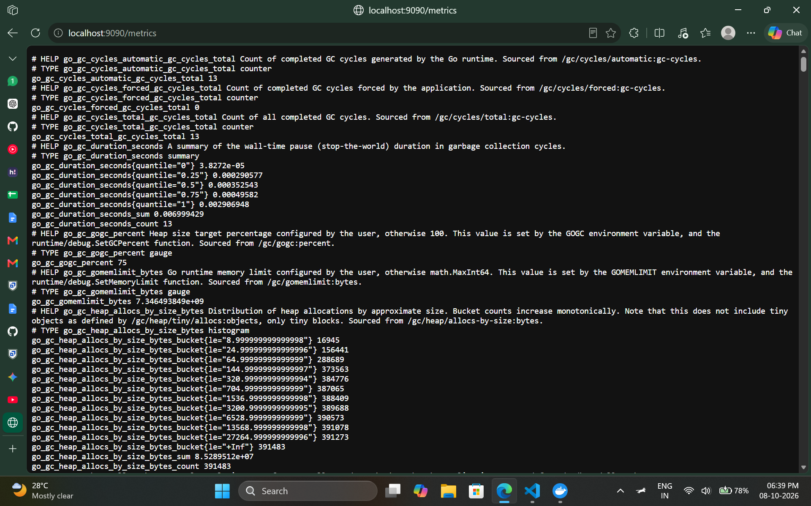
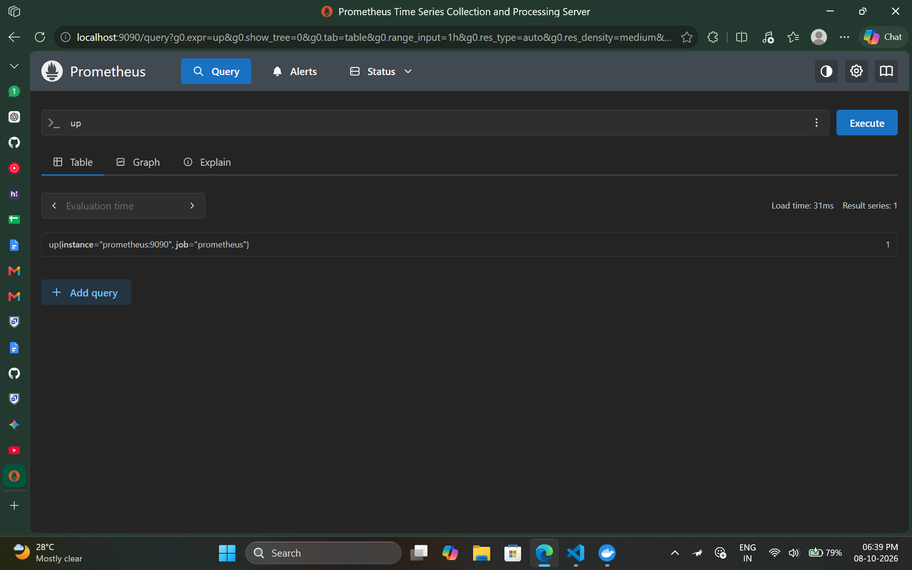
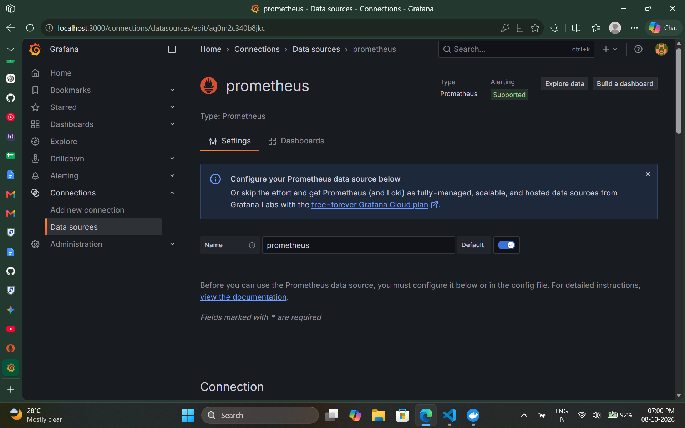
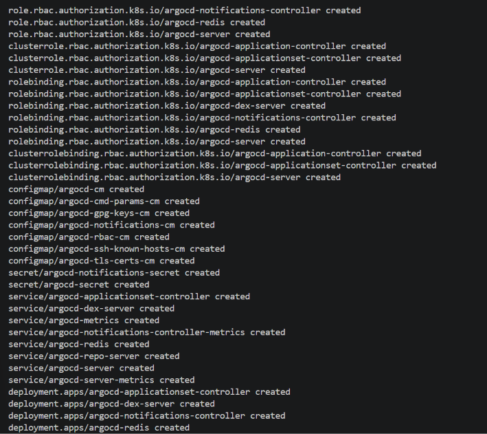

## Grafana

Grafana is connected to Prometheus as a data source. The screenshots show the connection test and Grafana dashboard and panel screens.

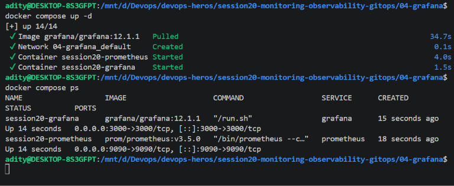
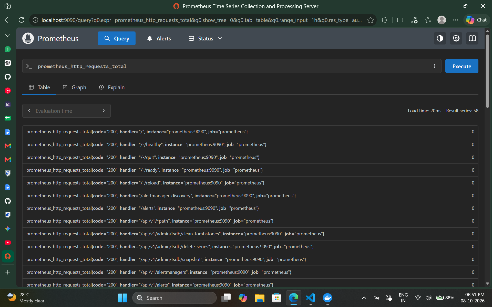
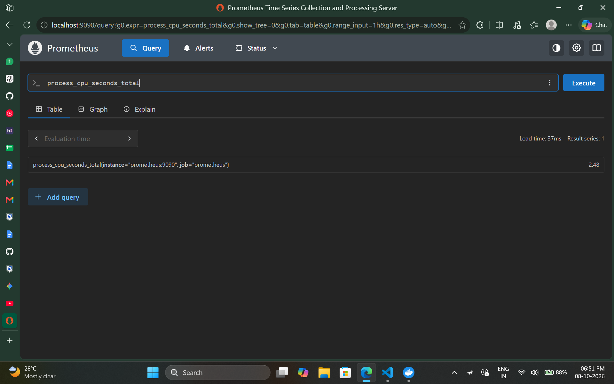
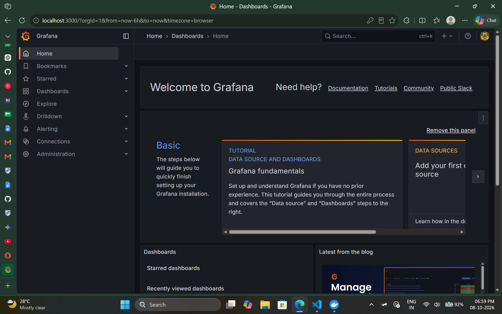
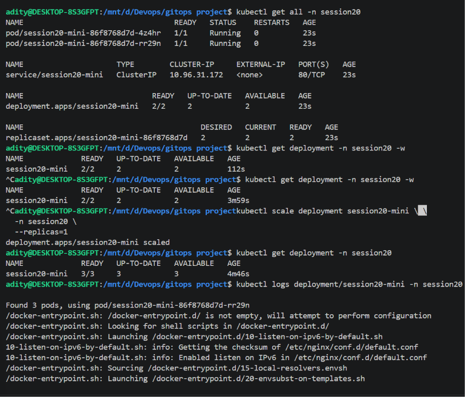

## What to observe

- **Metrics:** Prometheus exposes numeric, timestamped measurements that can be queried with PromQL.
- **CPU:** `process_cpu_seconds_total` is cumulative CPU time, not a percentage. For a CPU usage rate, query `rate(process_cpu_seconds_total[5m])`.
- **Memory:** Memory graphs require a memory metric from the application or a host/container exporter. This screenshot set does not show a configured memory exporter.
- **Health:** `up` indicates whether Prometheus can scrape a target; application health endpoints and Kubernetes readiness/liveness probes provide additional health signals.
- **Alerts:** Prometheus can evaluate alert rules against metrics and send firing notifications through Alertmanager. Alert rules and notification delivery are not shown in these screenshots.
- **Logs:** This demo focuses on metrics. A log backend such as Loki or Elasticsearch is needed to collect and search logs.

See [Observability](../observability/README.md) for the three observability pillars and common Kubernetes patterns, and [GitOps Demo](../gitops/README.md) for the Argo CD walkthrough.
