# Session 18: Terraform and Infrastructure as Code

## Terraform S3 demo

This walkthrough provisions one Amazon S3 bucket with Terraform, inspects the resulting state and outputs, and destroys the bucket after verification. The screenshots show the AWS provider initializing successfully (AWS provider `6.66.0`), configuration validation, a plan to create one bucket in `ap-south-1`, a successful apply, bucket details and outputs, a destroy plan, and successful deletion. This folder currently contains the walkthrough and screenshots; it does not contain the `.tf` files or `terraform.tfvars` needed to reproduce the commands.

> **Credential safety:** The `aws configure` screenshot visibly includes credential input. Redact or replace that screenshot before sharing this repository. If the input was a real AWS access key, deactivate/rotate it immediately and review CloudTrail for unexpected use. Never publish AWS access keys or secret keys in screenshots, source control, `terraform.tfvars`, or documentation. Prefer IAM Identity Center, an assumed role, or another short-lived credential provider over long-lived access keys.

## Prerequisites

- Terraform CLI installed.
- AWS CLI installed and authenticated with an identity authorized to manage the bucket. Use short-lived credentials where possible.
- A unique S3 bucket name. Bucket names are globally unique across AWS partitions and cannot be chosen merely by region.
- AWS region selected consistently for the provider and bucket.

Check the active identity and region before planning:

```sh
aws sts get-caller-identity
aws configure get region
```

## Terraform command workflow

Run these commands from the Terraform project directory, where the `.tf` files and `terraform.tfvars` are located.

### 1. Initialize — `terraform init`

```sh
terraform init
```

Initializes the working directory, downloads the required provider plugins, and configures the backend. The captured run reused the AWS provider version recorded in its dependency lock file and completed initialization successfully.

### 2. Format — `terraform fmt`

```sh
terraform fmt
```

Formats Terraform files to the canonical style. Review any changed files before continuing.

### 3. Validate — `terraform validate`

```sh
terraform validate
```

Checks the configuration syntax and internal consistency. The screenshot reports `Success! The configuration is valid.` Validation does not prove that AWS credentials, permissions, quotas, or a future apply will succeed.

### 4. Review the plan — `terraform plan`

```sh
terraform plan
```

Refreshes information about managed resources and displays proposed changes without applying them. The captured plan showed **1 to add, 0 to change, 0 to destroy** for an S3 bucket. Read the whole plan and check the selected account, region, bucket name, tags, and security settings before approving an apply.

The captured resource plan shows `force_destroy = true`; this allows Terraform to remove a bucket even when it contains objects, which can cause irreversible data loss. Avoid enabling it for production or any bucket with data that must be retained. The captured state also shows bucket versioning disabled. Enable versioning when recovery from accidental overwrites or deletes is required, and plan lifecycle and retention rules for old object versions.

For a saved, repeatable plan:

```sh
terraform plan -out=tfplan
terraform show tfplan
terraform apply tfplan
```

Plan files can contain sensitive values; do not commit them or upload them as public artifacts.

### 5. Apply — `terraform apply`

```sh
terraform apply
```

Shows the plan again and asks for confirmation before making changes. Type `yes` only after reviewing the proposed actions. The screenshot shows AWS creating one S3 bucket and Terraform reporting `Apply complete! Resources: 1 added, 0 changed, 0 destroyed.`

### 6. Inspect state — `terraform show`

```sh
terraform show
```

Displays the current Terraform state in a readable form. Treat the output as potentially sensitive: it can contain resource attributes that should not be shared publicly.

### 7. Read outputs — `terraform output`

```sh
terraform output
terraform output bucket_name
terraform output -raw bucket_name
```

Prints declared root-module outputs, such as a bucket name, ARN, or region. The captured output confirms that Terraform emitted the bucket outputs after apply. Output values may also be sensitive.

### 8. Verify the AWS resource

The screenshots use AWS CLI to list buckets and confirm the created bucket exists:

```sh
aws s3 ls
```

Use the exact bucket output from your own apply; do not copy a bucket name from another run. Do not upload real or sensitive objects as part of this introductory exercise.

### 9. Plan and destroy — `terraform destroy`

Review the destruction plan before confirming:

```sh
terraform plan -destroy
terraform destroy
```

The captured destroy plan showed **0 to add, 0 to change, 1 to destroy**, followed by a successful deletion and `Destroy complete! Resources: 1 destroyed.` Destroy is irreversible for deleted data. S3 buckets generally must be empty before Terraform can delete them; object versions and delete markers in a versioned bucket also need to be removed. Confirm the bucket contains no needed data before destruction.

## Screenshots

The screenshots are ordered to follow authentication/setup, initialization and validation, plan review, apply, state/output inspection, and destroy. Credentials and other sensitive values are intentionally not reproduced in this README.

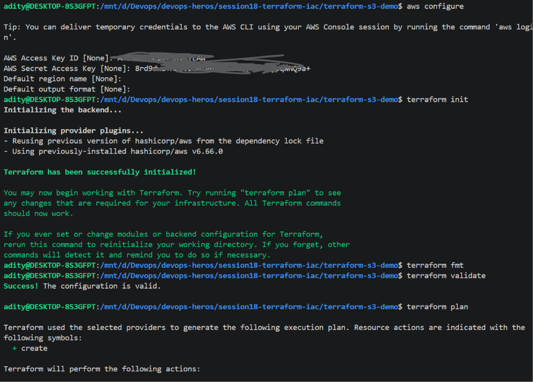

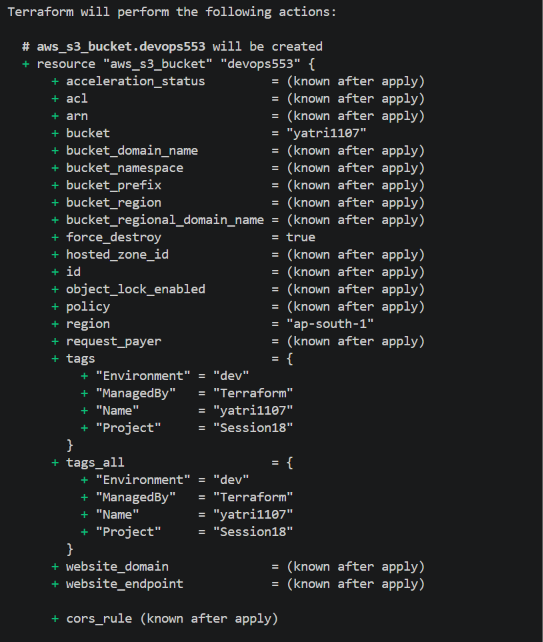

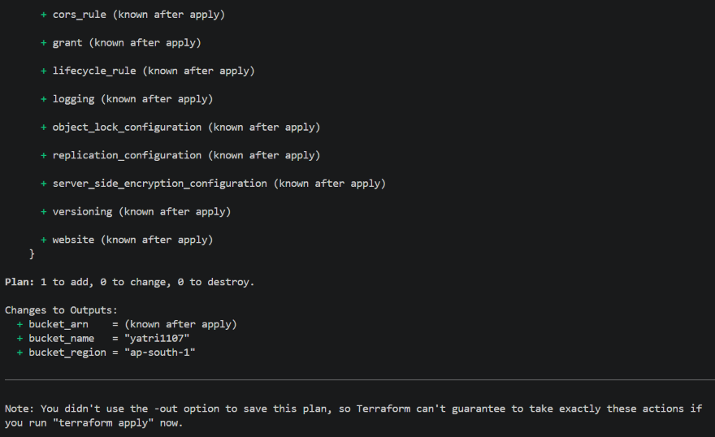

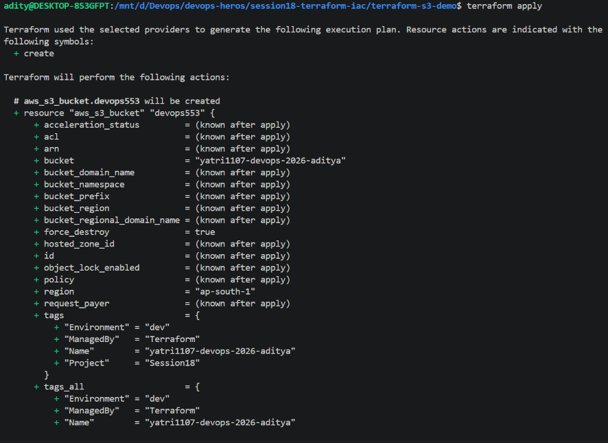

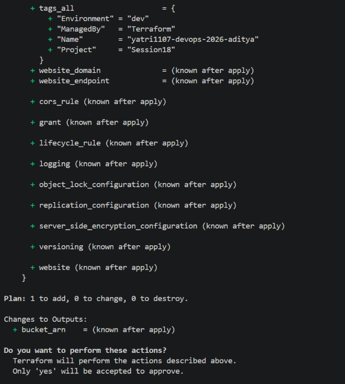

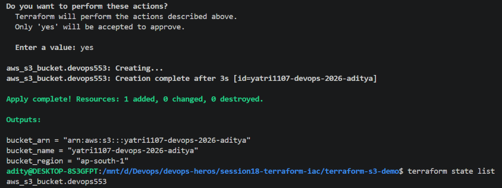

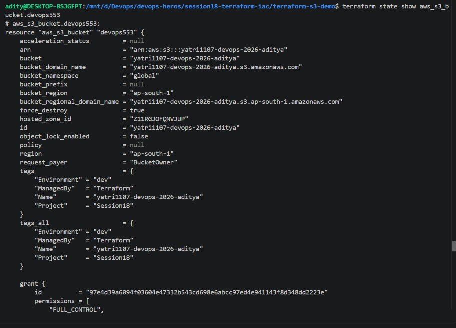

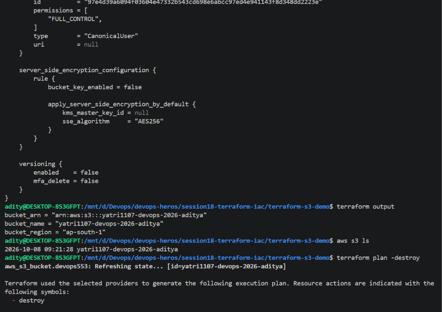

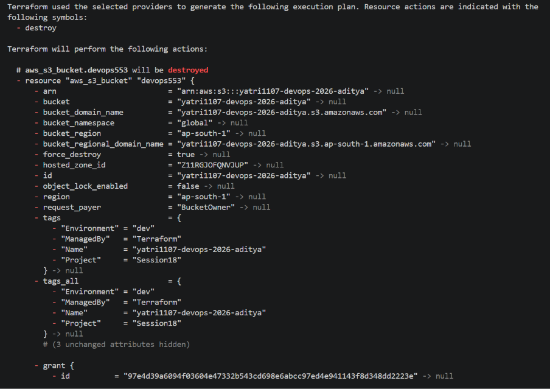

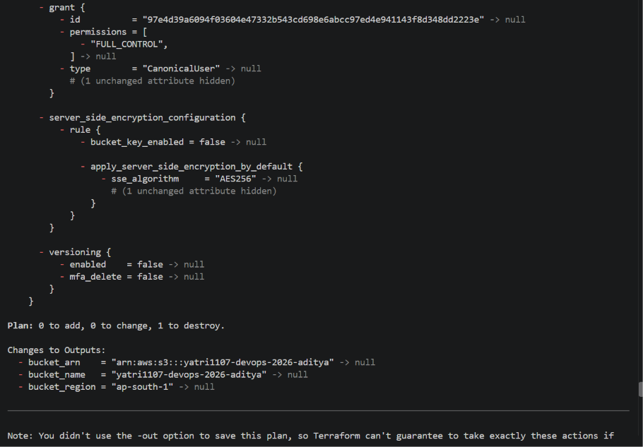

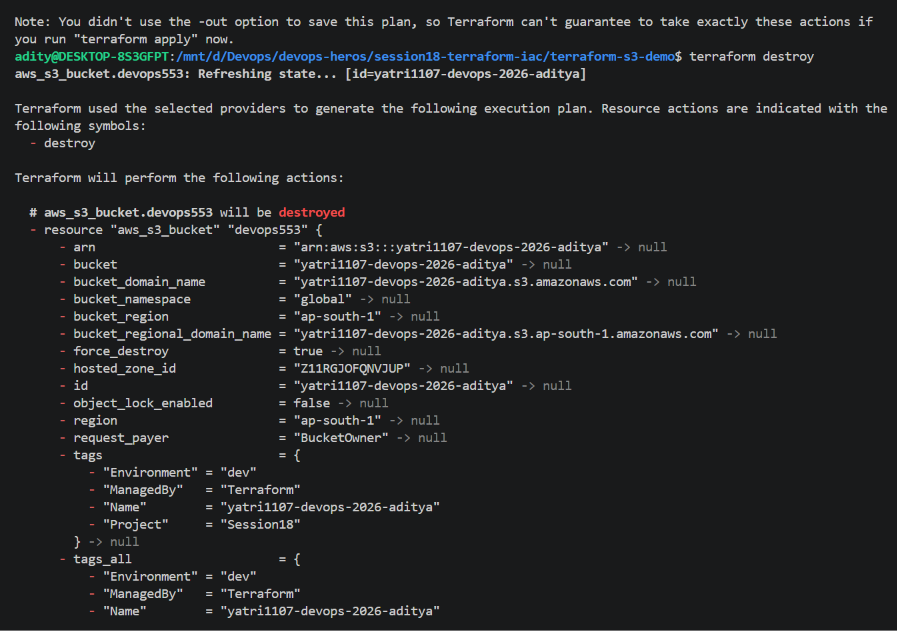

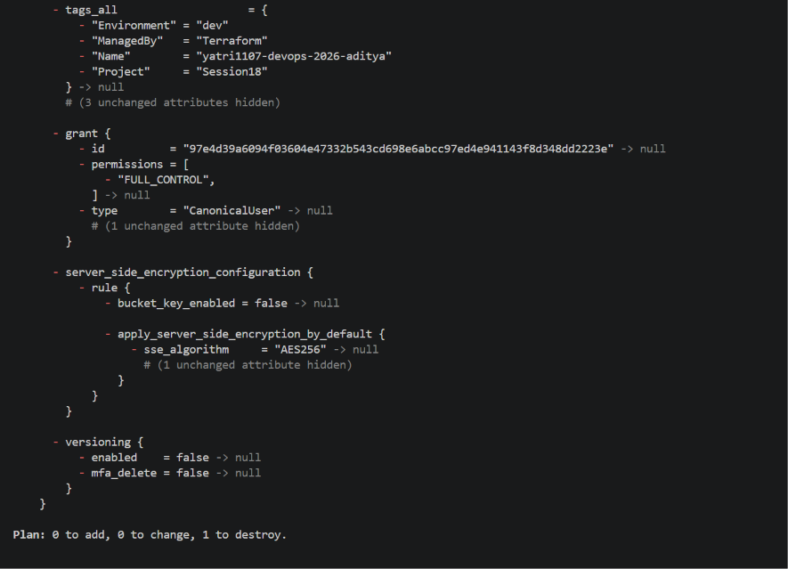

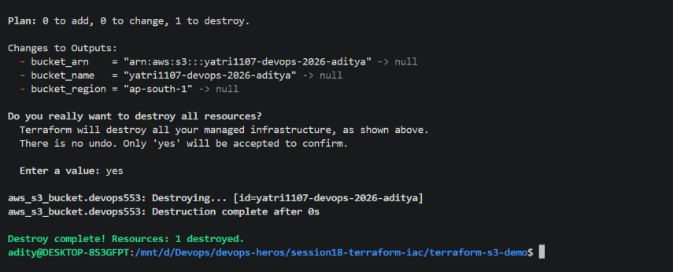

## AWS service research

- [IAM: identity, policies, and least privilege](aws-services/01-iam/README.md)
- [EC2: compute instances and lifecycle](aws-services/02-ec2/README.md)
- [S3: buckets, objects, and storage classes](aws-services/03-s3/README.md)
- [VPC: AWS networking fundamentals](aws-services/04-vpc/README.md)
- [DynamoDB and RDS: database services](aws-services/05-dynamodb-rds/README.md)
